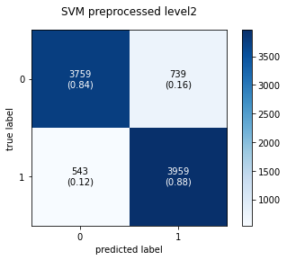

```python
## Practical Phase1 
## Amir Pourmand
## Stu No: 99210259
```

# Download Required Packages


```python
!gdown --id 15JJ6ZysFM57tlUjXo2nHVhkGwePbVMVV
```

    Downloading...
    From: https://drive.google.com/uc?id=15JJ6ZysFM57tlUjXo2nHVhkGwePbVMVV
    To: /content/dataset.csv
    59.7MB [00:00, 97.0MB/s]


```python
!pip install contractions
!pip install unidecode
!pip install word2number
```

    Collecting contractions
      Downloading contractions-0.0.52-py2.py3-none-any.whl (7.2 kB)
    Collecting textsearch>=0.0.21
      Downloading textsearch-0.0.21-py2.py3-none-any.whl (7.5 kB)
    Collecting pyahocorasick
      Downloading pyahocorasick-1.4.2.tar.gz (321 kB)
         |████████████████████████████████| 321 kB 5.7 MB/s 
    [?25hCollecting anyascii
      Downloading anyascii-0.2.0-py3-none-any.whl (283 kB)
         |████████████████████████████████| 283 kB 35.9 MB/s 
    [?25hBuilding wheels for collected packages: pyahocorasick
      Building wheel for pyahocorasick (setup.py) ... [?25l[?25hdone
      Created wheel for pyahocorasick: filename=pyahocorasick-1.4.2-cp37-cp37m-linux_x86_64.whl size=85440 sha256=eea7fcd5669f224c651f81dd0d9f3191da0400bafd1a714cb9206c0f38f0af2c
      Stored in directory: /root/.cache/pip/wheels/25/19/a6/8f363d9939162782bb8439d886469756271abc01f76fbd790f
    Successfully built pyahocorasick
    Installing collected packages: pyahocorasick, anyascii, textsearch, contractions
    Successfully installed anyascii-0.2.0 contractions-0.0.52 pyahocorasick-1.4.2 textsearch-0.0.21
    Collecting unidecode
      Downloading Unidecode-1.2.0-py2.py3-none-any.whl (241 kB)
         |████████████████████████████████| 241 kB 5.4 MB/s 
    [?25hInstalling collected packages: unidecode
    Successfully installed unidecode-1.2.0
    Collecting word2number
      Downloading word2number-1.1.zip (9.7 kB)
    Building wheels for collected packages: word2number
      Building wheel for word2number (setup.py) ... [?25l[?25hdone
      Created wheel for word2number: filename=word2number-1.1-py3-none-any.whl size=5581 sha256=2280688a40803ead93d0b281a4597cbc5002a70afc345b4be2f91aa7d3c99392
      Stored in directory: /root/.cache/pip/wheels/4b/c3/77/a5f48aeb0d3efb7cd5ad61cbd3da30bbf9ffc9662b07c9f879
    Successfully built word2number
    Installing collected packages: word2number
    Successfully installed word2number-1.1


## Imports


```python
import pandas as pd
import numpy as np
import sklearn 
from sklearn.model_selection import train_test_split


#for bag of words
from sklearn.feature_extraction.text import CountVectorizer


#these are all for preprocessing
import nltk
from nltk.tokenize import word_tokenize
import re
from bs4 import BeautifulSoup
import spacy
import unidecode
from word2number import w2n
import contractions

from nltk.corpus import stopwords
from nltk.stem import WordNetLemmatizer
# this is required for word_tokenize
nltk.download('punkt')
nltk.download('stopwords')
nltk.download('wordnet')
```

    [nltk_data] Downloading package punkt to /root/nltk_data...
    [nltk_data]   Unzipping tokenizers/punkt.zip.
    [nltk_data] Downloading package stopwords to /root/nltk_data...
    [nltk_data]   Unzipping corpora/stopwords.zip.
    [nltk_data] Downloading package wordnet to /root/nltk_data...
    [nltk_data]   Unzipping corpora/wordnet.zip.


    True


## Preprocessing Text Functions


```python
def remove_all_non_alphabetic(text):
  return re.sub('[^A-Za-z]',' ',text)

def strip_html_tags(text):
    """remove html tags from text"""
    soup = BeautifulSoup(text, "html.parser")
    stripped_text = soup.get_text(separator=" ")
    return stripped_text

def remove_accented_chars(text):
    """remove accented characters from text, e.g. café"""
    text = unidecode.unidecode(text)
    return text

stop_words = set(stopwords.words('english'))
def remove_stop_words(token):
  return [item for item in token if item not in stop_words]

lemma = WordNetLemmatizer()
def lemmatization(token):
  return [lemma.lemmatize(word=w,pos='v') for w in token]

def clean_length(token):
  return [item for item in token if len(item)>2]

def punctuation_removal(text):
    return re.sub(r'[\.\?\!\,\:\;\"]', '', text)

def text_merge(token):
  return ' '.join([i for i in token if not i.isdigit()])
```

# Split the data


```python
raw_data = pd.read_csv('dataset.csv')
raw_data['sentiment'] = raw_data['sentiment'].apply(lambda input: 1 if input == 'positive' else 0)

#0 means unprocessed
X_train_0,X_test_0,y_train,y_test=train_test_split(raw_data['comment'],raw_data['sentiment'],test_size=0.2)

# 1 means one level of pre-processing
X_train_1,X_test_1=X_train_0.copy(),X_test_0.copy()

# 2 means two level of pre-processing
X_train_2,X_test_2=X_train_0.copy(),X_test_0.copy()
```

## Preprocess Data


```python
def process_level1(data):
    return (data.apply(str.lower)
                .apply(remove_all_non_alphabetic)
                .apply(word_tokenize)
                .apply(text_merge))

def process_level2(data):
    return (data.apply(str.lower)
        .apply(contractions.fix)
        .apply(strip_html_tags)
        .apply(remove_accented_chars)
        .apply(remove_all_non_alphabetic)
        .apply(word_tokenize)
        .apply(remove_stop_words)
        .apply(lemmatization)
        .apply(clean_length)
        .apply(text_merge))
```


```python
X_train_1 = process_level1(X_train_1)
X_test_1 = process_level1(X_test_1)

X_train_2 = process_level2(X_train_2)
X_test_2 = process_level2(X_test_2)
```

## Bag of Words Representation


```python
def convert_to_BOW(train,test):
    vectorizer = CountVectorizer(max_df=0.4,min_df=0.01,lowercase=False)
    X_train_transformed = vectorizer.fit_transform(train)
    X_test_transformed = vectorizer.transform(test)
    return X_train_transformed,X_test_transformed
```


```python
X_train_0_BOW,X_test_0_BOW = convert_to_BOW(X_train_0,X_test_0)
X_train_1_BOW,X_test_1_BOW = convert_to_BOW(X_train_1,X_test_1)
X_train_2_BOW,X_test_2_BOW = convert_to_BOW(X_train_2,X_test_2)
```


```python
X_train_0_BOW
```


    <36000x1807 sparse matrix of type '<class 'numpy.int64'>'
    	with 2787010 stored elements in Compressed Sparse Row format>


```python

```

# Models 

## 1- Regression Model


```python
import warnings
warnings.filterwarnings("ignore", category=DeprecationWarning)

def warn(*args, **kwargs):
    pass
import warnings
warnings.warn = warn
```


```python
from mlxtend.plotting import plot_confusion_matrix
from sklearn.metrics import confusion_matrix as cm
from sklearn.metrics import classification_report
import matplotlib.pyplot as plt
def print_confusion_matrix(y_test,y_prediction,title):
    print(classification_report(y_test,y_prediction))
    matrix = cm(y_test,y_prediction)
    fig, ax = plot_confusion_matrix(conf_mat=matrix,
                                    show_absolute=True,
                                    show_normed=True,
                                    colorbar=True)
    plt.title(title)
    plt.show()
```


```python
from sklearn.linear_model import LogisticRegression
  
def regression(X_train,X_test,y_train,**kwarg):
    clf = LogisticRegression(**kwarg).fit(X_train, y_train)
    return clf.predict(X_test),clf
```


```python
print_confusion_matrix(y_test,regression(X_train_0_BOW,X_test_0_BOW,y_train)[0],'Regression not preprocessed')
print_confusion_matrix(y_test,regression(X_train_1_BOW,X_test_1_BOW,y_train)[0],'Regression preprocessed level1')
print_confusion_matrix(y_test,regression(X_train_2_BOW,X_test_2_BOW,y_train)[0],'Regression preprocessed level2')
```

                  precision    recall  f1-score   support
    
               0       0.87      0.88      0.87      4438
               1       0.88      0.88      0.88      4562
    
        accuracy                           0.88      9000
       macro avg       0.88      0.88      0.88      9000
    weighted avg       0.88      0.88      0.88      9000
    


    

    


                  precision    recall  f1-score   support
    
               0       0.88      0.88      0.88      4438
               1       0.88      0.88      0.88      4562
    
        accuracy                           0.88      9000
       macro avg       0.88      0.88      0.88      9000
    weighted avg       0.88      0.88      0.88      9000
    


    

    


                  precision    recall  f1-score   support
    
               0       0.89      0.88      0.88      4438
               1       0.88      0.89      0.89      4562
    
        accuracy                           0.88      9000
       macro avg       0.88      0.88      0.88      9000
    weighted avg       0.88      0.88      0.88      9000
    


    

    


## 2- KNN Model


```python
from sklearn.neighbors import KNeighborsClassifier
def knn(X_train,X_test,y_train):
    neigh = KNeighborsClassifier(n_neighbors=5)
    neigh.fit(X_train, y_train)
    return neigh.predict(X_test),neigh
```


```python
print_confusion_matrix(y_test,knn(X_train_0_BOW,X_test_0_BOW,y_train)[0],'KNN Not Preprocessed')
print_confusion_matrix(y_test,knn(X_train_1_BOW,X_test_1_BOW,y_train)[0],'KNN Preprocessed Level1')
print_confusion_matrix(y_test,knn(X_train_2_BOW,X_test_2_BOW,y_train)[0],'KNN Preprocessed Level2')
```

                  precision    recall  f1-score   support
    
               0       0.61      0.73      0.66      4438
               1       0.67      0.54      0.60      4562
    
        accuracy                           0.63      9000
       macro avg       0.64      0.64      0.63      9000
    weighted avg       0.64      0.63      0.63      9000
    


    

    


                  precision    recall  f1-score   support
    
               0       0.63      0.74      0.68      4438
               1       0.69      0.58      0.63      4562
    
        accuracy                           0.66      9000
       macro avg       0.66      0.66      0.65      9000
    weighted avg       0.66      0.66      0.65      9000
    


    

    


                  precision    recall  f1-score   support
    
               0       0.66      0.71      0.68      4438
               1       0.69      0.64      0.67      4562
    
        accuracy                           0.67      9000
       macro avg       0.68      0.67      0.67      9000
    weighted avg       0.68      0.67      0.67      9000
    


    

    


## 3- SVM Model


```python
from sklearn.svm import SVC
from sklearn.pipeline import make_pipeline
def svm(X_train,X_test,y_train):
    clf = make_pipeline( SVC(gamma='auto'))
    clf.fit(X_train, y_train)
    return clf.predict(X_test),clf
```


```python
print_confusion_matrix(y_test,svm(X_train_0_BOW,X_test_0_BOW,y_train)[0],'SVM Not Preprocessed')
print_confusion_matrix(y_test,svm(X_train_1_BOW,X_test_1_BOW,y_train)[0],'SVM proprocessed level1')
print_confusion_matrix(y_test,svm(X_train_2_BOW,X_test_2_BOW,y_train)[0],'SVM preprocessed level2')
```

                  precision    recall  f1-score   support
    
               0       0.87      0.84      0.85      4498
               1       0.84      0.87      0.86      4502
    
        accuracy                           0.86      9000
       macro avg       0.86      0.86      0.86      9000
    weighted avg       0.86      0.86      0.86      9000
    


    

    


                  precision    recall  f1-score   support
    
               0       0.87      0.84      0.86      4498
               1       0.85      0.88      0.86      4502
    
        accuracy                           0.86      9000
       macro avg       0.86      0.86      0.86      9000
    weighted avg       0.86      0.86      0.86      9000
    


    

    


                  precision    recall  f1-score   support
    
               0       0.87      0.84      0.85      4498
               1       0.84      0.88      0.86      4502
    
        accuracy                           0.86      9000
       macro avg       0.86      0.86      0.86      9000
    weighted avg       0.86      0.86      0.86      9000
    


    

    


# Word2Vector and HyperParameter Effect


```python
# https://www.kaggle.com/pierremegret/gensim-word2vec-tutorial
# https://www.kaggle.com/kstathou/word-embeddings-logistic-regression
```


```python
import gensim.models

w2v = gensim.models.Word2Vec( [row.split() for row in X_train_2], 
                             min_count=50,
                            window=10, 
                            size=300)
```


```python
w2v.most_similar('king')
```


    [('lion', 0.7712827324867249),
     ('stephen', 0.7464975118637085),
     ('solomon', 0.7280431985855103),
     ('lord', 0.706125020980835),
     ('legend', 0.6681618094444275),
     ('princess', 0.6676332950592041),
     ('kings', 0.6650164127349854),
     ('rice', 0.6360715627670288),
     ('queen', 0.6311061978340149),
     ('immortal', 0.6231356859207153)]


```python
def document_vector(doc):
    doc = [word for word in doc.split() if word in w2v.wv.vocab]
    return np.mean(w2v[doc], axis=0)
```


```python
X_train_w2v = X_train_2.apply(document_vector)
X_test_w2v = X_test_2.apply(document_vector)
```

    /usr/local/lib/python3.7/dist-packages/ipykernel_launcher.py:3: DeprecationWarning: Call to deprecated `__getitem__` (Method will be removed in 4.0.0, use self.wv.__getitem__() instead).
      This is separate from the ipykernel package so we can avoid doing imports until


## Logistic Regression


```python
lr_w2v_pred,regression_w2v = regression(list(X_train_w2v),list(X_test_w2v),y_train,
                                            C=150,max_iter=10000)
print_confusion_matrix(y_test,lr_w2v_pred,'Word2Vector: Regression preprocessed level2')

lr_bow_pred,regression_BOW = regression(X_train_2_BOW,X_test_2_BOW,y_train)
print_confusion_matrix(y_test,lr_bow_pred,'BagOfWords: Regression preprocessed level2')
```

                  precision    recall  f1-score   support
    
               0       0.89      0.86      0.87      4569
               1       0.86      0.89      0.87      4431
    
        accuracy                           0.87      9000
       macro avg       0.87      0.87      0.87      9000
    weighted avg       0.87      0.87      0.87      9000
    


    

    


                  precision    recall  f1-score   support
    
               0       0.88      0.85      0.87      4569
               1       0.85      0.88      0.87      4431
    
        accuracy                           0.87      9000
       macro avg       0.87      0.87      0.87      9000
    weighted avg       0.87      0.87      0.87      9000
    


    

    


## KNN


```python
knn_w2v_pred,knn_w2v = knn(list(X_train_w2v),list(X_test_w2v),y_train)

print_confusion_matrix(y_test,knn_w2v_pred,'Word2vec: Preprocessed Level2')

knn_bow_pred,knn_bow = knn(X_train_2_BOW,X_test_2_BOW,y_train)
print_confusion_matrix(y_test,knn_bow_pred,'BagOfWords: KNN Preprocessed Level2')
```

                  precision    recall  f1-score   support
    
               0       0.81      0.84      0.82      4438
               1       0.84      0.81      0.82      4562
    
        accuracy                           0.82      9000
       macro avg       0.82      0.82      0.82      9000
    weighted avg       0.82      0.82      0.82      9000
    


    

    


                  precision    recall  f1-score   support
    
               0       0.66      0.71      0.68      4438
               1       0.69      0.64      0.67      4562
    
        accuracy                           0.67      9000
       macro avg       0.68      0.67      0.67      9000
    weighted avg       0.68      0.67      0.67      9000
    


    

    


## SVM


```python
svm_w2v_pred,svm_w2v=svm(list(X_train_w2v),list(X_test_w2v),y_train)
svm_bow_pred,svm_bow = svm(X_train_2_BOW,X_test_2_BOW,y_train)

print_confusion_matrix(y_test,svm_w2v_pred,'W2V: SVM preprocessed level2')
print_confusion_matrix(y_test,svm_bow_pred,'BOW: SVM preprocessed level2')
```

                  precision    recall  f1-score   support
    
               0       0.88      0.86      0.87      4438
               1       0.87      0.89      0.88      4562
    
        accuracy                           0.87      9000
       macro avg       0.87      0.87      0.87      9000
    weighted avg       0.87      0.87      0.87      9000
    


    

    


                  precision    recall  f1-score   support
    
               0       0.89      0.85      0.87      4438
               1       0.86      0.89      0.88      4562
    
        accuracy                           0.87      9000
       macro avg       0.87      0.87      0.87      9000
    weighted avg       0.87      0.87      0.87      9000
    


    

    


## MLP

### TF-IDF Vectorizer


```python
from sklearn.feature_extraction.text import TfidfVectorizer
vectorizer = TfidfVectorizer( min_df=0.01,max_df=0.5)
X_train_2_tfidf=vectorizer.fit_transform(X_train_2)
X_test_2_tfidf = vectorizer.transform(X_test_2)
```


```python
from sklearn.neural_network import MLPClassifier
from sklearn.model_selection import GridSearchCV

grid = {
    'hidden_layer_sizes':[(80),(70,),(40,10),(90)],
}
mlp = MLPClassifier(learning_rate='adaptive',solver='adam')
mlp_cv = GridSearchCV (estimator=mlp,param_grid=grid,cv=2)

mlp_cv.fit(X_train_2_tfidf,y_train)

mlp_prediction=mlp_cv.predict(X_test_2_tfidf)
print_confusion_matrix(y_test,mlp_prediction,'TFIDF: MLP ')
```

    {'mean_fit_time': array([110.42653728, 104.80755305,  37.31890857, 109.83874869]), 'std_fit_time': array([3.38637757, 0.72014499, 2.2723614 , 1.20505762]), 'mean_score_time': array([0.14038301, 0.12818861, 0.07941163, 0.14955759]), 'std_score_time': array([0.00110602, 0.00455904, 0.00154245, 0.00252771]), 'param_hidden_layer_sizes': masked_array(data=[80, (70,), (40, 10), 90],
                 mask=[False, False, False, False],
           fill_value='?',
                dtype=object), 'params': [{'hidden_layer_sizes': 80}, {'hidden_layer_sizes': (70,)}, {'hidden_layer_sizes': (40, 10)}, {'hidden_layer_sizes': 90}], 'split0_test_score': array([0.85511111, 0.85561111, 0.84366667, 0.85822222]), 'split1_test_score': array([0.85838889, 0.85694444, 0.84683333, 0.85838889]), 'mean_test_score': array([0.85675   , 0.85627778, 0.84525   , 0.85830556]), 'std_test_score': array([1.63888889e-03, 6.66666667e-04, 1.58333333e-03, 8.33333333e-05]), 'rank_test_score': array([2, 3, 4, 1], dtype=int32)}
                  precision    recall  f1-score   support
    
               0       0.87      0.86      0.87      4453
               1       0.86      0.88      0.87      4547
    
        accuracy                           0.87      9000
       macro avg       0.87      0.87      0.87      9000
    weighted avg       0.87      0.87      0.87      9000
    


    

    


```python
pd.DataFrame(mlp_cv.cv_results_)
```


<div>
<style scoped>
    .dataframe tbody tr th:only-of-type {
        vertical-align: middle;
    }

    .dataframe tbody tr th {
        vertical-align: top;
    }

    .dataframe thead th {
        text-align: right;
    }
</style>
<table border="1" class="dataframe">
  <thead>
    <tr style="text-align: right;">
      <th></th>
      <th>mean_fit_time</th>
      <th>std_fit_time</th>
      <th>mean_score_time</th>
      <th>std_score_time</th>
      <th>param_hidden_layer_sizes</th>
      <th>params</th>
      <th>split0_test_score</th>
      <th>split1_test_score</th>
      <th>mean_test_score</th>
      <th>std_test_score</th>
      <th>rank_test_score</th>
    </tr>
  </thead>
  <tbody>
    <tr>
      <th>0</th>
      <td>110.426537</td>
      <td>3.386378</td>
      <td>0.140383</td>
      <td>0.001106</td>
      <td>80</td>
      <td>{'hidden_layer_sizes': 80}</td>
      <td>0.855111</td>
      <td>0.858389</td>
      <td>0.856750</td>
      <td>0.001639</td>
      <td>2</td>
    </tr>
    <tr>
      <th>1</th>
      <td>104.807553</td>
      <td>0.720145</td>
      <td>0.128189</td>
      <td>0.004559</td>
      <td>(70,)</td>
      <td>{'hidden_layer_sizes': (70,)}</td>
      <td>0.855611</td>
      <td>0.856944</td>
      <td>0.856278</td>
      <td>0.000667</td>
      <td>3</td>
    </tr>
    <tr>
      <th>2</th>
      <td>37.318909</td>
      <td>2.272361</td>
      <td>0.079412</td>
      <td>0.001542</td>
      <td>(40, 10)</td>
      <td>{'hidden_layer_sizes': (40, 10)}</td>
      <td>0.843667</td>
      <td>0.846833</td>
      <td>0.845250</td>
      <td>0.001583</td>
      <td>4</td>
    </tr>
    <tr>
      <th>3</th>
      <td>109.838749</td>
      <td>1.205058</td>
      <td>0.149558</td>
      <td>0.002528</td>
      <td>90</td>
      <td>{'hidden_layer_sizes': 90}</td>
      <td>0.858222</td>
      <td>0.858389</td>
      <td>0.858306</td>
      <td>0.000083</td>
      <td>1</td>
    </tr>
  </tbody>
</table>
</div>


```python
mlp_90 = MLPClassifier(learning_rate='adaptive',solver='adam',hidden_layer_sizes=(90))
mlp_90.fit(X_train_2_tfidf,y_train)
mlp_prediction=mlp_90.predict(X_test_2_tfidf)
print_confusion_matrix(y_test,mlp_prediction,'TFIDF: MLP ')
```

                  precision    recall  f1-score   support
    
               0       0.87      0.86      0.86      4453
               1       0.86      0.88      0.87      4547
    
        accuracy                           0.87      9000
       macro avg       0.87      0.87      0.87      9000
    weighted avg       0.87      0.87      0.87      9000
    


    

    


# Google Drive Save


```python
# Load the Drive helper and mount
from google.colab import drive
drive.mount('/content/drive')
```

    Mounted at /content/drive


```python
import scipy.sparse
import numpy
scipy.sparse.save_npz('/content/drive/MyDrive/DataForColob/ML_Project/X_train_2_BOW',X_train_2_BOW)
scipy.sparse.save_npz('/content/drive/MyDrive/DataForColob/ML_Project/X_test_2_BOW',X_test_2_BOW)

X_train_w2v.to_pickle('/content/drive/MyDrive/DataForColob/ML_Project/X_train_w2v.pkl')
X_test_w2v.to_pickle('/content/drive/MyDrive/DataForColob/ML_Project/X_test_w2v.pkl')

numpy.save("/content/drive/MyDrive/DataForColob/ML_Project/y_train", y_train)
numpy.save("/content/drive/MyDrive/DataForColob/ML_Project/y_test", y_test)
```


```python
import pickle
pickle.dump(svm_w2v, open('/content/drive/MyDrive/DataForColob/ML_Project/SVM.pkl', 'wb'))
pickle.dump(knn_w2v,open('/content/drive/MyDrive/DataForColob/ML_Project/KNN.pkl', 'wb'))
pickle.dump(regression_w2v,open('/content/drive/MyDrive/DataForColob/ML_Project/LR.pkl', 'wb'))
```


```python
import pickle
pickle.dump(mlp_90,open('/content/drive/MyDrive/DataForColob/ML_Project/best.pkl', 'wb'))
pickle.dump(vectorizer,open('/content/drive/MyDrive/DataForColob/ML_Project/vectorizer.pkl', 'wb'))
```


```python

```
