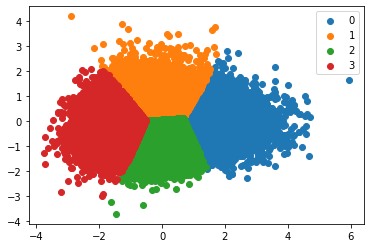
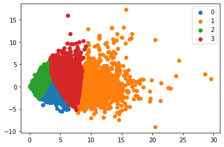
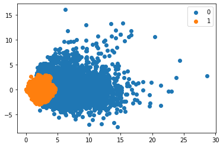

```python
## Practical Phase1 
## Amir Pourmand
## Stu No: 99210259
```

# Downloading Required Dataset


```python
!gdown --id 15JJ6ZysFM57tlUjXo2nHVhkGwePbVMVV -O dataset_first.csv
```

    Downloading...
    From: https://drive.google.com/uc?id=15JJ6ZysFM57tlUjXo2nHVhkGwePbVMVV
    To: /content/dataset_first.csv
    59.7MB [00:00, 96.0MB/s]


```python
!gdown --id 1uykBJxWH5v5BsSuuwM0r9WLiKWQrDiDJ -O dataset_tune.csv
```

    Downloading...
    From: https://drive.google.com/uc?id=1uykBJxWH5v5BsSuuwM0r9WLiKWQrDiDJ
    To: /content/dataset_tune.csv
    100% 211k/211k [00:00<00:00, 6.41MB/s]


```python
import pandas as pd
dataset = pd.read_csv('dataset_first.csv')
dataset_tune = pd.read_csv('dataset_tune.csv')
```


```python
# Load the Drive helper and mount
from google.colab import drive
drive.mount('/content/drive')
```

    Mounted at /content/drive


```python
import scipy.sparse
import numpy
import pandas as pd

X_train_2_BOW=scipy.sparse.load_npz('/content/drive/MyDrive/DataForColob/ML_Project/X_train_2_BOW.npz')
X_test_2_BOW=scipy.sparse.load_npz('/content/drive/MyDrive/DataForColob/ML_Project/X_test_2_BOW.npz')

X_train_w2v=pd.read_pickle('/content/drive/MyDrive/DataForColob/ML_Project/X_train_w2v.pkl')
X_test_w2v=pd.read_pickle('/content/drive/MyDrive/DataForColob/ML_Project/X_test_w2v.pkl')

y_train = numpy.load('/content/drive/MyDrive/DataForColob/ML_Project/y_train.npy')
y_test = numpy.load('/content/drive/MyDrive/DataForColob/ML_Project/y_test.npy')

import pickle
svm_w2v = pickle.load(open('/content/drive/MyDrive/DataForColob/ML_Project/SVM.pkl', 'rb'))
knn_w2v = pickle.load(open('/content/drive/MyDrive/DataForColob/ML_Project/KNN.pkl', 'rb'))
lr_w2v = pickle.load(open('/content/drive/MyDrive/DataForColob/ML_Project/LR.pkl', 'rb'))
mlp_best = pickle.load(open('/content/drive/MyDrive/DataForColob/ML_Project/best.pkl', 'rb'))
vectorizer_tfidf=pickle.load(open('/content/drive/MyDrive/DataForColob/ML_Project/vectorizer.pkl', 'rb'))

X_w2v = list(X_train_w2v)
X_w2v.extend(X_test_w2v )
len(X_w2v)
```


    45000


```python
import numpy as np
y_total = np.concatenate([y_train,y_test])
X_bow = scipy.sparse.vstack([X_train_2_BOW,X_test_2_BOW])
```


```python
lr_w2v.score(list(X_test_w2v),y_test)
```


    0.8848888888888888


# Imports 


```python
import numpy as np
import matplotlib.pyplot as plt
```

# Clustering 

## PCA 


```python
from sklearn.decomposition import PCA
pca=PCA(n_components=2)
pca_w2v=pca.fit_transform(X_w2v)
```

## SVD


```python
from sklearn.decomposition import TruncatedSVD
svd = TruncatedSVD(n_components=2, n_iter=7)
svd_bow=svd.fit_transform(X_bow)
svd_bow.shape
```


    (45000, 2)


## K-Means 


```python
import matplotlib.pyplot as plt
def plot_scatter(X,pred):
    u_labels = np.unique(pred)
    for i in u_labels:
        plt.scatter(X[pred==i,0],X[pred==i,1],label=i)
    plt.legend()
    plt.show()
```


```python
from sklearn.cluster import KMeans

for k in range(2,6):
    kmeans = KMeans(n_clusters=k)
    kmeans_label=kmeans.fit_predict(pca_w2v)
    plot_scatter(pca_w2v,kmeans_label)
```


    

    


    

    


    

    


    

    


```python
from sklearn.cluster import KMeans

for k in range(2,6):
    kmeans = KMeans(n_clusters=k)
    kmeans_label=kmeans.fit_predict(svd_bow)
    plot_scatter(svd_bow,kmeans_label)
```


    

    


    

    


    

    


    

    


## GMM


```python
from sklearn.mixture import GaussianMixture

for k in range(2,6):
    gm = GaussianMixture(n_components=k)
    gm_pred=gm.fit_predict(pca_w2v)
    plot_scatter(pca_w2v,gm_pred)
```


    

    


    

    


    

    


    

    


```python
from sklearn.mixture import GaussianMixture

for k in range(2,6):
    gm = GaussianMixture(n_components=k)
    gm_pred=gm.fit_predict(svd_bow)
    plot_scatter(svd_bow,gm_pred)
```


    

    


    

    


    

    


    

    


## Agglomorative 


```python
from sklearn.cluster import AgglomerativeClustering

max_data= 30000
for k in range(2,6):
    agg = AgglomerativeClustering(n_clusters=k)
    agg_pred=agg.fit_predict(pca_w2v[:max_data])
    plot_scatter(pca_w2v[:max_data],agg_pred)
```


    

    


    

    


    

    


    

    


```python
from sklearn.cluster import AgglomerativeClustering

max_data= 30000
for k in range(2,6):
    agg = AgglomerativeClustering(n_clusters=k)
    agg_pred=agg.fit_predict(svd_bow[:max_data])
    plot_scatter(svd_bow[:max_data],agg_pred)
```


    

    


    

    


    

    


    

    


## Comparsion


```python
from sklearn import metrics

def get_analysis(name,true_label,predicted_label):
    print('V Measure ', name, ':', metrics.v_measure_score(true_label,predicted_label))
    print('Adjusted RandScore Measure ', name, ':', metrics.adjusted_rand_score(true_label,predicted_label))
    print('Adjusted Mutual Information ', name, ':', metrics.adjusted_mutual_info_score(true_label,predicted_label))
    print('Homogenity', name, ':', metrics.homogeneity_score(true_label,predicted_label))
    print('-'*30)
```


```python
from sklearn.cluster import KMeans
from sklearn.mixture import GaussianMixture
from sklearn.cluster import AgglomerativeClustering
from sklearn import metrics

kmeans = KMeans(n_clusters=2)
kmeans_label=kmeans.fit_predict(pca_w2v)

gm = GaussianMixture(n_components=2)
gm_pred=gm.fit_predict(pca_w2v)

max_data = 30000
agg = AgglomerativeClustering(n_clusters=2)
agg_pred=agg.fit_predict(pca_w2v[:max_data])

get_analysis('kmeans',y_total,kmeans_label)
get_analysis('gm', y_total,gm_pred)
get_analysis('agg',y_total[:max_data],agg_pred)
```

    V Measure  kmeans : 0.03865260111674556
    Adjusted RandScore Measure  kmeans : 0.052532117323756226
    Adjusted Mutual Information  kmeans : 0.038637148304102975
    Homogenity kmeans : 0.038548295065080805
    ------------------------------
    V Measure  gm : 0.04585216408127864
    Adjusted RandScore Measure  gm : 0.06102151128817464
    Adjusted Mutual Information  gm : 0.045836750679784814
    Homogenity gm : 0.045502049103971876
    ------------------------------
    V Measure  agg : 0.027294842860872137
    Adjusted RandScore Measure  agg : 0.015243361512629535
    Adjusted Mutual Information  agg : 0.02726576198577149
    Homogenity agg : 0.021955360291170237
    ------------------------------


```python
from sklearn.cluster import KMeans
from sklearn.mixture import GaussianMixture
from sklearn.cluster import AgglomerativeClustering
from sklearn import metrics

kmeans = KMeans(n_clusters=2)
kmeans_label=kmeans.fit_predict(svd_bow)

gm = GaussianMixture(n_components=2)
gm_pred=gm.fit_predict(svd_bow)

max_data = 30000
agg = AgglomerativeClustering(n_clusters=2)
agg_pred=agg.fit_predict(svd_bow[:max_data])

get_analysis('kmeans',y_total,kmeans_label)
get_analysis('gm', y_total,gm_pred)
get_analysis('agg',y_total[:max_data],agg_pred)
```

    V Measure  kmeans : 4.4201352885522176e-06
    Adjusted RandScore Measure  kmeans : -9.666372297861207e-06
    Adjusted Mutual Information  kmeans : -1.4863700544218863e-05
    Homogenity kmeans : 3.6745964811703372e-06
    ------------------------------
    V Measure  gm : 5.55823659046331e-05
    Adjusted RandScore Measure  gm : 3.329568631687747e-05
    Adjusted Mutual Information  gm : 3.765064848960804e-05
    Homogenity gm : 4.9688144512804354e-05
    ------------------------------
    V Measure  agg : 0.0004589444711261654
    Adjusted RandScore Measure  agg : 0.0003702319505944534
    Adjusted Mutual Information  agg : 0.0004321287391475934
    Homogenity agg : 0.00041137599303339186
    ------------------------------


## Semantic Comparison


```python
gm = GaussianMixture(n_components=3)
gm_pred=gm.fit_predict(pca_w2v)
for i in range(3):
    print(list(dataset[gm_pred==i][2:3]['sentiment']))
for i in range(3):
    print(list(dataset[gm_pred==i][2:3]['comment']))
```

    ['negative']
    ['positive']
    ['positive']
    ["It's amazing that this no talent actor Chapa got all these well known stars to appear in this dismal, pathetic, cheesy and overlong film about a low life gangster who looks white but is half Mexican, much of the acting is bad and many of the well known stars in this trashy movie are given a script that seems made up by a 16 year old, i'm sure this movie is the career low point for actors such as Dunaway, Wagner, Keach, Tilly and Busey who i'm sure are very embarrassed that they ever appeared in this turkey of a film. I doubt many people have ever heard of Chapa and after this terrible movie i'm sure he will disappear into oblivion where he belongs."]
    ['I think this is a great, classic monster film for the family. The mole, what a machine! The tall creature with the beak, the flying green lizards, Ranthorincus/mayas or whatever they are and the ape men things the speak telepathically with them. The battle of the men in rubber suits fighting for a doll for breakfast umm! yummy! Class, what else can I say? How would they make a 2002 remake of this one?']
    ["I saw this film over Christmas, and what a great film it was! It tells the story of Custer (played by Errol Flynn) during and after his graduation from Westpoint. Although I've heard that the film isn't very historically accurate (Hollywood never is) I still enjoyed it as I knew little of the real events anyway.<br /><br />I thought Errol Flynn was brilliant as Custer and has since become my favourite actor! His acting alongside Olivia De Havilland was brilliant and the ending was fantastic! It brought me close to tears as he and Ned Sharp (Arthur Kennedy) rode to their deaths on little big horn.<br /><br />I had always known that Errol Flynn was a brilliant actor as he was my dads favourite actor, and I grew up watching his films as a child. But it wasn't until I watched this film that I realised how great he actually was.<br /><br />I'll give this film 10 out of 10!!"]


```python
# first one - very negative
# second one: very positive
# third one: good but not very complimentary
```

# Fine Tuning

## Initial Run on MLP


```python
!pip install contractions
!pip install unidecode
!pip install word2number

import pandas as pd
import numpy as np
import sklearn 
from sklearn.model_selection import train_test_split


#for bag of words
from sklearn.feature_extraction.text import CountVectorizer


#these are all for preprocessing
import nltk
from nltk.tokenize import word_tokenize
import re
from bs4 import BeautifulSoup
import spacy
import unidecode
from word2number import w2n
import contractions

from nltk.corpus import stopwords
from nltk.stem import WordNetLemmatizer
# this is required for word_tokenize
nltk.download('punkt')
nltk.download('stopwords')
nltk.download('wordnet')
```

    Requirement already satisfied: contractions in /usr/local/lib/python3.7/dist-packages (0.0.52)
    Requirement already satisfied: textsearch>=0.0.21 in /usr/local/lib/python3.7/dist-packages (from contractions) (0.0.21)
    Requirement already satisfied: anyascii in /usr/local/lib/python3.7/dist-packages (from textsearch>=0.0.21->contractions) (0.2.0)
    Requirement already satisfied: pyahocorasick in /usr/local/lib/python3.7/dist-packages (from textsearch>=0.0.21->contractions) (1.4.2)
    Requirement already satisfied: unidecode in /usr/local/lib/python3.7/dist-packages (1.2.0)
    Requirement already satisfied: word2number in /usr/local/lib/python3.7/dist-packages (1.1)
    [nltk_data] Downloading package punkt to /root/nltk_data...
    [nltk_data]   Package punkt is already up-to-date!
    [nltk_data] Downloading package stopwords to /root/nltk_data...
    [nltk_data]   Package stopwords is already up-to-date!
    [nltk_data] Downloading package wordnet to /root/nltk_data...
    [nltk_data]   Package wordnet is already up-to-date!


    True


```python
def remove_all_non_alphabetic(text):
  return re.sub('[^A-Za-z]',' ',text)

def strip_html_tags(text):
    """remove html tags from text"""
    soup = BeautifulSoup(text, "html.parser")
    stripped_text = soup.get_text(separator=" ")
    return stripped_text

def remove_accented_chars(text):
    """remove accented characters from text, e.g. café"""
    text = unidecode.unidecode(text)
    return text

stop_words = set(stopwords.words('english'))
def remove_stop_words(token):
  return [item for item in token if item not in stop_words]

lemma = WordNetLemmatizer()
def lemmatization(token):
  return [lemma.lemmatize(word=w,pos='v') for w in token]

def clean_length(token):
  return [item for item in token if len(item)>2]

def punctuation_removal(text):
    return re.sub(r'[\.\?\!\,\:\;\"]', '', text)

def text_merge(token):
  return ' '.join([i for i in token if not i.isdigit()])
```


```python
def process_level1(data):
    return (data.apply(str.lower)
                .apply(remove_all_non_alphabetic)
                .apply(word_tokenize)
                .apply(text_merge))

def process_level2(data):
    return (data.apply(str.lower)
        .apply(contractions.fix)
        .apply(strip_html_tags)
        .apply(remove_accented_chars)
        .apply(remove_all_non_alphabetic)
        .apply(word_tokenize)
        .apply(remove_stop_words)
        .apply(lemmatization)
        .apply(clean_length)
        .apply(text_merge))
```


```python
X_train_small,X_test_small,y_train_small,y_test_small=train_test_split(dataset_tune['comment'],
                                                                       dataset_tune['sentiment'],test_size=0.2)

X_train_small = process_level2(X_train_small)
X_test_small = process_level2(X_test_small)

from sklearn.feature_extraction.text import TfidfVectorizer
vectorizer = TfidfVectorizer( min_df=0.01,max_df=0.5)
X_train_small_tfidf=vectorizer.fit_transform(X_train_small)
X_test_small_tfidf = vectorizer.transform(X_test_small)
```


```python
from mlxtend.plotting import plot_confusion_matrix
from sklearn.metrics import confusion_matrix as cm
from sklearn.metrics import classification_report
import matplotlib.pyplot as plt
def print_confusion_matrix(y_test,y_prediction,title):
    print(classification_report(y_test,y_prediction))
    matrix = cm(y_test,y_prediction)
    fig, ax = plot_confusion_matrix(conf_mat=matrix,
                                    show_absolute=True,
                                    show_normed=True,
                                    colorbar=True)
    plt.title(title)
    plt.show()
```


```python
from sklearn.neural_network import MLPClassifier
from sklearn.model_selection import GridSearchCV

grid_params = {
    'hidden_layer_sizes':[(250),(100),(90),(40,10),(50,10)]
}

mlp = MLPClassifier(learning_rate='adaptive',solver='adam',max_iter=1000)

mlp_cv = GridSearchCV(estimator=mlp,param_grid=grid_params,cv=2)

mlp_cv.fit(X_train_small_tfidf,y_train_small)
mlp_prediction=mlp_cv.predict(X_test_small_tfidf)
print_confusion_matrix(y_test_small,mlp_prediction,'TFIDF: MLP ')

display(pd.DataFrame( mlp_cv.cv_results_))
```

                  precision    recall  f1-score   support
    
               0       0.87      0.90      0.89        52
               1       0.89      0.85      0.87        48
    
        accuracy                           0.88       100
       macro avg       0.88      0.88      0.88       100
    weighted avg       0.88      0.88      0.88       100
    


    

    


<div>
<style scoped>
    .dataframe tbody tr th:only-of-type {
        vertical-align: middle;
    }

    .dataframe tbody tr th {
        vertical-align: top;
    }

    .dataframe thead th {
        text-align: right;
    }
</style>
<table border="1" class="dataframe">
  <thead>
    <tr style="text-align: right;">
      <th></th>
      <th>mean_fit_time</th>
      <th>std_fit_time</th>
      <th>mean_score_time</th>
      <th>std_score_time</th>
      <th>param_hidden_layer_sizes</th>
      <th>params</th>
      <th>split0_test_score</th>
      <th>split1_test_score</th>
      <th>mean_test_score</th>
      <th>std_test_score</th>
      <th>rank_test_score</th>
    </tr>
  </thead>
  <tbody>
    <tr>
      <th>0</th>
      <td>1.871995</td>
      <td>0.039519</td>
      <td>0.002856</td>
      <td>0.000094</td>
      <td>250</td>
      <td>{'hidden_layer_sizes': 250}</td>
      <td>0.670</td>
      <td>0.72</td>
      <td>0.6950</td>
      <td>0.0250</td>
      <td>3</td>
    </tr>
    <tr>
      <th>1</th>
      <td>1.200242</td>
      <td>0.023092</td>
      <td>0.001634</td>
      <td>0.000002</td>
      <td>100</td>
      <td>{'hidden_layer_sizes': 100}</td>
      <td>0.665</td>
      <td>0.71</td>
      <td>0.6875</td>
      <td>0.0225</td>
      <td>5</td>
    </tr>
    <tr>
      <th>2</th>
      <td>1.142486</td>
      <td>0.057154</td>
      <td>0.001538</td>
      <td>0.000028</td>
      <td>90</td>
      <td>{'hidden_layer_sizes': 90}</td>
      <td>0.685</td>
      <td>0.72</td>
      <td>0.7025</td>
      <td>0.0175</td>
      <td>1</td>
    </tr>
    <tr>
      <th>3</th>
      <td>0.777441</td>
      <td>0.026190</td>
      <td>0.001333</td>
      <td>0.000018</td>
      <td>(40, 10)</td>
      <td>{'hidden_layer_sizes': (40, 10)}</td>
      <td>0.690</td>
      <td>0.69</td>
      <td>0.6900</td>
      <td>0.0000</td>
      <td>4</td>
    </tr>
    <tr>
      <th>4</th>
      <td>0.785442</td>
      <td>0.013229</td>
      <td>0.001348</td>
      <td>0.000012</td>
      <td>(50, 10)</td>
      <td>{'hidden_layer_sizes': (50, 10)}</td>
      <td>0.675</td>
      <td>0.73</td>
      <td>0.7025</td>
      <td>0.0275</td>
      <td>1</td>
    </tr>
  </tbody>
</table>
</div>


## Fine tune based on previous model


```python
X_train_small_tfidf_olddata=vectorizer_tfidf.transform(X_train_small)
X_test_small_tfidf_olddata = vectorizer_tfidf.transform(X_test_small)

mlp_best = MLPClassifier(warm_start=True)
mlp_best.fit(X_train_small_tfidf_olddata,y_train_small)
mlp_prediction=mlp_best.predict(X_test_small_tfidf_olddata)
print_confusion_matrix(y_test_small,mlp_prediction,'TFIDF: MLP ')
```

                  precision    recall  f1-score   support
    
               0       0.86      0.94      0.90        52
               1       0.93      0.83      0.88        48
    
        accuracy                           0.89       100
       macro avg       0.89      0.89      0.89       100
    weighted avg       0.89      0.89      0.89       100
    


    

    


```python

```
