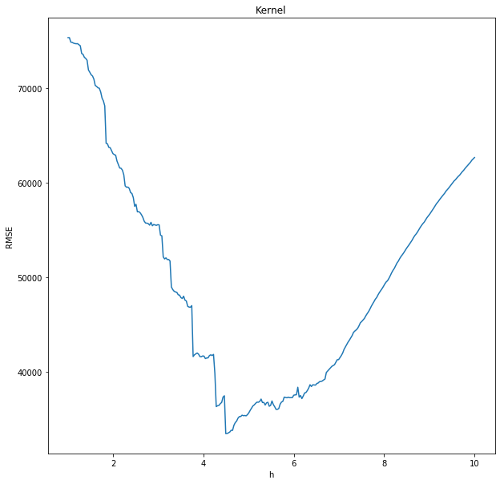
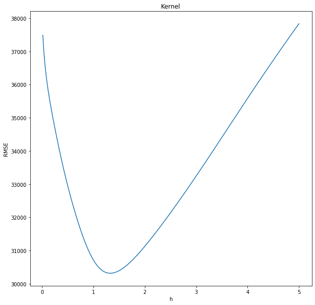
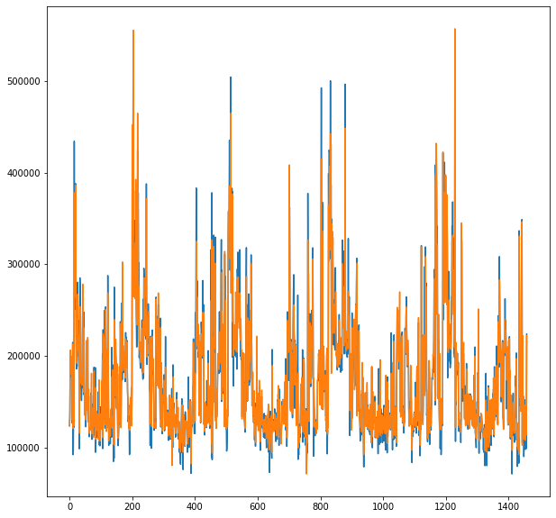
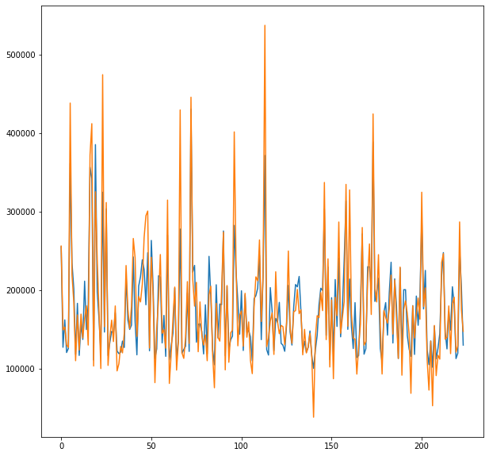
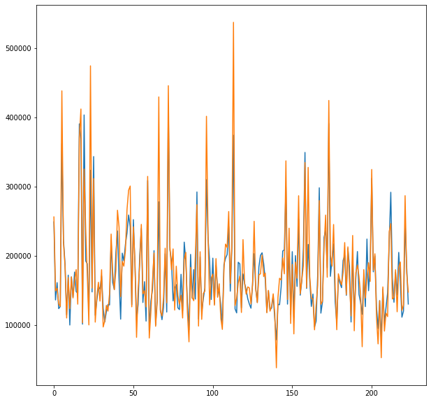

```python
import matplotlib.pyplot as plt
# ^^^ pyforest auto-imports - don't write above this line
import numpy as np
import pandas as pd
```


```python
data=pd.read_csv('G:\Documents\ReferenceBooks\MachineLearning\Rohban\Homework\HW3\TrainPreprocessed.csv')
data_test = pd.read_csv('G:\Documents\ReferenceBooks\MachineLearning\Rohban\Homework\HW3\TestPreprocessed.csv')
```


```python
data
```


<div>
<style scoped>
    .dataframe tbody tr th:only-of-type {
        vertical-align: middle;
    }

    .dataframe tbody tr th {
        vertical-align: top;
    }

    .dataframe thead th {
        text-align: right;
    }
</style>
<table border="1" class="dataframe">
  <thead>
    <tr style="text-align: right;">
      <th></th>
      <th>BsmtQual</th>
      <th>1stFlrSF</th>
      <th>MasVnrArea</th>
      <th>SaleCondition_Partial</th>
      <th>GarageType_Detchd</th>
      <th>OverallQual</th>
      <th>GarageYrBlt</th>
      <th>FullBath</th>
      <th>TotalBsmtSF</th>
      <th>YearBuilt</th>
      <th>...</th>
      <th>BsmtFinSF1</th>
      <th>GarageFinish</th>
      <th>Neighborhood_NridgHt</th>
      <th>MasVnrType_None</th>
      <th>MSSubClass_60.0</th>
      <th>GarageCars</th>
      <th>GarageArea</th>
      <th>FireplaceQu_IsNull</th>
      <th>GrLivArea</th>
      <th>SalePrice</th>
    </tr>
  </thead>
  <tbody>
    <tr>
      <td>0</td>
      <td>-0.623056</td>
      <td>-0.793162</td>
      <td>0.511243</td>
      <td>-0.30589</td>
      <td>-0.600353</td>
      <td>0.651256</td>
      <td>1.020807</td>
      <td>0.789470</td>
      <td>-0.459145</td>
      <td>1.050634</td>
      <td>...</td>
      <td>0.575228</td>
      <td>-0.223588</td>
      <td>-0.235877</td>
      <td>-1.203608</td>
      <td>1.969844</td>
      <td>0.311618</td>
      <td>0.350880</td>
      <td>1.056020</td>
      <td>0.370207</td>
      <td>208500.0</td>
    </tr>
    <tr>
      <td>1</td>
      <td>-0.623056</td>
      <td>0.257052</td>
      <td>-0.574214</td>
      <td>-0.30589</td>
      <td>-0.600353</td>
      <td>-0.071812</td>
      <td>-0.104447</td>
      <td>0.789470</td>
      <td>0.466305</td>
      <td>0.156680</td>
      <td>...</td>
      <td>1.171591</td>
      <td>-0.223588</td>
      <td>-0.235877</td>
      <td>0.830266</td>
      <td>-0.507307</td>
      <td>0.311618</td>
      <td>-0.060710</td>
      <td>-0.946303</td>
      <td>-0.482347</td>
      <td>181500.0</td>
    </tr>
    <tr>
      <td>2</td>
      <td>-0.623056</td>
      <td>-0.627611</td>
      <td>0.322950</td>
      <td>-0.30589</td>
      <td>-0.600353</td>
      <td>0.651256</td>
      <td>0.937455</td>
      <td>0.789470</td>
      <td>-0.313261</td>
      <td>0.984415</td>
      <td>...</td>
      <td>0.092875</td>
      <td>-0.223588</td>
      <td>-0.235877</td>
      <td>-1.203608</td>
      <td>1.969844</td>
      <td>0.311618</td>
      <td>0.631510</td>
      <td>-0.946303</td>
      <td>0.514836</td>
      <td>223500.0</td>
    </tr>
    <tr>
      <td>3</td>
      <td>0.865071</td>
      <td>-0.521555</td>
      <td>-0.574214</td>
      <td>-0.30589</td>
      <td>1.664545</td>
      <td>0.651256</td>
      <td>0.812427</td>
      <td>-1.025689</td>
      <td>-0.687089</td>
      <td>-1.862993</td>
      <td>...</td>
      <td>-0.499103</td>
      <td>1.041440</td>
      <td>-0.235877</td>
      <td>0.830266</td>
      <td>-0.507307</td>
      <td>1.649742</td>
      <td>0.790533</td>
      <td>-0.946303</td>
      <td>0.383528</td>
      <td>140000.0</td>
    </tr>
    <tr>
      <td>4</td>
      <td>-0.623056</td>
      <td>-0.045596</td>
      <td>1.364102</td>
      <td>-0.30589</td>
      <td>-0.600353</td>
      <td>1.374324</td>
      <td>0.895779</td>
      <td>0.789470</td>
      <td>0.199611</td>
      <td>0.951306</td>
      <td>...</td>
      <td>0.463410</td>
      <td>-0.223588</td>
      <td>-0.235877</td>
      <td>-1.203608</td>
      <td>1.969844</td>
      <td>1.649742</td>
      <td>1.697903</td>
      <td>-0.946303</td>
      <td>1.298881</td>
      <td>250000.0</td>
    </tr>
    <tr>
      <td>...</td>
      <td>...</td>
      <td>...</td>
      <td>...</td>
      <td>...</td>
      <td>...</td>
      <td>...</td>
      <td>...</td>
      <td>...</td>
      <td>...</td>
      <td>...</td>
      <td>...</td>
      <td>...</td>
      <td>...</td>
      <td>...</td>
      <td>...</td>
      <td>...</td>
      <td>...</td>
      <td>...</td>
      <td>...</td>
      <td>...</td>
      <td>...</td>
    </tr>
    <tr>
      <td>1455</td>
      <td>-0.623056</td>
      <td>-0.542249</td>
      <td>-0.574214</td>
      <td>-0.30589</td>
      <td>-0.600353</td>
      <td>-0.071812</td>
      <td>0.854103</td>
      <td>0.789470</td>
      <td>-0.238040</td>
      <td>0.918196</td>
      <td>...</td>
      <td>-0.972685</td>
      <td>-0.223588</td>
      <td>-0.235877</td>
      <td>0.830266</td>
      <td>1.969844</td>
      <td>0.311618</td>
      <td>-0.060710</td>
      <td>-0.946303</td>
      <td>0.250316</td>
      <td>175000.0</td>
    </tr>
    <tr>
      <td>1456</td>
      <td>-0.623056</td>
      <td>2.354894</td>
      <td>0.084814</td>
      <td>-0.30589</td>
      <td>-0.600353</td>
      <td>-0.071812</td>
      <td>-0.021095</td>
      <td>0.789470</td>
      <td>1.104547</td>
      <td>0.222899</td>
      <td>...</td>
      <td>0.759399</td>
      <td>1.041440</td>
      <td>-0.235877</td>
      <td>-1.203608</td>
      <td>-0.507307</td>
      <td>0.311618</td>
      <td>0.126376</td>
      <td>-0.946303</td>
      <td>1.061003</td>
      <td>210000.0</td>
    </tr>
    <tr>
      <td>1457</td>
      <td>0.865071</td>
      <td>0.065634</td>
      <td>-0.574214</td>
      <td>-0.30589</td>
      <td>-0.600353</td>
      <td>0.651256</td>
      <td>-1.563110</td>
      <td>0.789470</td>
      <td>0.215567</td>
      <td>-1.002149</td>
      <td>...</td>
      <td>-0.369744</td>
      <td>-0.223588</td>
      <td>-0.235877</td>
      <td>0.830266</td>
      <td>-0.507307</td>
      <td>-1.026506</td>
      <td>-1.033560</td>
      <td>-0.946303</td>
      <td>1.569110</td>
      <td>266500.0</td>
    </tr>
    <tr>
      <td>1458</td>
      <td>0.865071</td>
      <td>-0.218907</td>
      <td>-0.574214</td>
      <td>-0.30589</td>
      <td>-0.600353</td>
      <td>-0.794879</td>
      <td>-1.188025</td>
      <td>-1.025689</td>
      <td>0.046889</td>
      <td>-0.704164</td>
      <td>...</td>
      <td>-0.865252</td>
      <td>1.041440</td>
      <td>-0.235877</td>
      <td>0.830266</td>
      <td>-0.507307</td>
      <td>-1.026506</td>
      <td>-1.089686</td>
      <td>1.056020</td>
      <td>-0.832502</td>
      <td>142125.0</td>
    </tr>
    <tr>
      <td>1459</td>
      <td>0.865071</td>
      <td>0.241532</td>
      <td>-0.574214</td>
      <td>-0.30589</td>
      <td>-0.600353</td>
      <td>-0.794879</td>
      <td>-0.562884</td>
      <td>-1.025689</td>
      <td>0.452629</td>
      <td>-0.207523</td>
      <td>...</td>
      <td>0.847099</td>
      <td>-1.488617</td>
      <td>-0.235877</td>
      <td>0.830266</td>
      <td>-0.507307</td>
      <td>-1.026506</td>
      <td>-0.921308</td>
      <td>1.056020</td>
      <td>-0.493765</td>
      <td>147500.0</td>
    </tr>
  </tbody>
</table>
<p>1460 rows × 28 columns</p>
</div>


```python
class GaussianKernels:
    def __init__(self,sigma,X_train,Y_train):
        self.X_train = X_train
        self.Y_train = Y_train
        self.sigma = sigma

    def calculate_kernel(self,x_i,x_j):
        return 1/(np.sqrt(2*np.pi))*np.exp(-0.5*np.square(np.linalg.norm(x=x_i - x_j,axis=-1))/self.sigma)

    def predict(self,x_test):
        kernels=self.calculate_kernel(self.X_train,x_test)
        if np.sum(kernels)==0:
            return self.Y_train.mean()
        weights = kernels / np.sum(kernels)
        return np.dot(weights,self.Y_train)
```


```python
class IndicatorKernels:
    def __init__(self,h,X_train,Y_train):
        self.X_train = X_train
        self.Y_train = Y_train
        self.h = h

    def calculate_kernel(self,x_i,x_j):
         return np.where(np.abs(np.linalg.norm(x=x_i - x_j,axis=-1)) <= self.h,1,0)

    def predict(self,x_test):
        kernels=self.calculate_kernel(self.X_train,x_test)
        if np.sum(kernels)==0:
            return self.Y_train.mean()
        weights = kernels / np.sum(kernels)
        return np.dot(weights,self.Y_train)
```


```python
mask = np.random.rand(len(data)) <= 0.85
train =data[mask]
test = data[~mask]

X_train = train.drop(['SalePrice'],axis=1).to_numpy().astype(np.dtype('float64'))
X_test = test.drop(['SalePrice'],axis=1).to_numpy().astype(np.dtype('float64'))
Y_train = train['SalePrice'].to_numpy().astype(np.dtype('float64'))
Y_test = test['SalePrice'].to_numpy().astype(np.dtype('float64'))
```


```python
answers = {}
for h in np.linspace(1,10,300):
    kernel_regressor=IndicatorKernels(h,X_train,Y_train)
    sum = 0
    predicted=[]
    for test in X_test:
        y_prediction=kernel_regressor.predict(test)
        predicted.append(y_prediction)
    
    predicted = np.array(predicted)
    result = np.sqrt(np.mean(np.square(predicted-Y_test)))
    answers[h] = result

plt.figure(figsize=(10,10))
answers_np=np.array(list(answers.items()))
plt.title('Kernel')
plt.xlabel('h')
plt.ylabel('RMSE')
print(np.nanmin(answers_np[:,1]))
plt.plot(answers_np[:,0],answers_np[:,1])

min_indicator = np.argmin(answers_np[:,1])
print(answers_np[min_indicator,:])
```


    <IPython.core.display.Javascript object>


    <IPython.core.display.Javascript object>


    <IPython.core.display.Javascript object>


    <IPython.core.display.Javascript object>


    33498.15061130628


    <IPython.core.display.Javascript object>


    [4.49163880e+00 3.34981506e+04]


    

    


```python
answers = {}
for h in np.linspace(0,5,300):
    kernel_regressor=GaussianKernels(h,X_train,Y_train)
    sum = 0
    predicted=[]
    for test in X_test:
        y_prediction=kernel_regressor.predict(test)
        predicted.append(y_prediction)
    
    predicted = np.array(predicted)
    result = np.sqrt(np.mean(np.square(predicted-Y_test)))
    answers[h] = result

plt.figure(figsize=(10,10))
answers_np2=np.array(list(answers.items()))
plt.title('Kernel')
plt.xlabel('h')
plt.ylabel('RMSE')
print(np.nanmin(answers_np2[:,1]))
plt.plot(answers_np2[:,0],answers_np2[:,1])

min_gaussian = np.nanargmin(answers_np2[:,1])
print(answers_np2[min_gaussian,:])
```

    C:\ProgramData\Anaconda3\lib\site-packages\ipykernel_launcher.py:8: RuntimeWarning: divide by zero encountered in true_divide
      
    C:\ProgramData\Anaconda3\lib\site-packages\ipykernel_launcher.py:8: RuntimeWarning: invalid value encountered in true_divide
      


    <IPython.core.display.Javascript object>


    <IPython.core.display.Javascript object>


    <IPython.core.display.Javascript object>


    <IPython.core.display.Javascript object>


    30318.27613520855


    <IPython.core.display.Javascript object>


    [1.32107023e+00 3.03182761e+04]


    

    


```python
kernel_regressor=IndicatorKernels(answers_np[min_indicator,0],X_train,Y_train)
predictionOfIndicator = []
for row in data_test.to_numpy().astype(np.dtype('float64')):
    predictionOfIndicator.append(kernel_regressor.predict(row))
predictionOfIndicatorNumpy = np.array(predictionOfIndicator)
```


```python
kernel_gaussian=GaussianKernels(answers_np2[min_gaussian,0],X_train,Y_train)
predictionOfGuassian = []
for row in data_test.to_numpy().astype(np.dtype('float64')):
    predictionOfGuassian.append(kernel_gaussian.predict(row))
predictionOfGaussianNumpy = np.array(predictionOfGuassian)
```

## Plot of test results


```python
plt.figure(figsize=(10,10))
plt.plot(predictionOfGaussianNumpy)
plt.plot(predictionOfIndicatorNumpy)
```


    <IPython.core.display.Javascript object>


    <IPython.core.display.Javascript object>


    <IPython.core.display.Javascript object>


    [<matplotlib.lines.Line2D at 0x1b6379101c8>]


    

    


## plot of best results of gaussian kernel vs actual result


```python
kernel_regressor=IndicatorKernels(answers_np[min_indicator,0],X_train,Y_train)
predictionOfIndicator = []
for row in X_test:
    predictionOfIndicator.append(kernel_regressor.predict(row))
predictionOfIndicatorNumpy = np.array(predictionOfIndicator)

plt.figure(figsize=(10,10))
plt.plot(predictionOfIndicatorNumpy)
plt.plot(Y_test)
```


    <IPython.core.display.Javascript object>


    <IPython.core.display.Javascript object>


    <IPython.core.display.Javascript object>


    [<matplotlib.lines.Line2D at 0x1b63793c1c8>]


    

    


## plot of best results of indicator kernel vs actual result


```python
kernel_gaussian=GaussianKernels(answers_np2[min_gaussian,0],X_train,Y_train)
predictionOfGuassian = []
for row in X_test:
    predictionOfGuassian.append(kernel_gaussian.predict(row))
predictionOfGaussianNumpy = np.array(predictionOfGuassian)

plt.figure(figsize=(10,10))
plt.plot(predictionOfGaussianNumpy)
plt.plot(Y_test)
```


    <IPython.core.display.Javascript object>


    <IPython.core.display.Javascript object>


    <IPython.core.display.Javascript object>


    [<matplotlib.lines.Line2D at 0x1b6376e9d48>]


    

    


```python
np.savetxt("G:\Documents\ReferenceBooks\MachineLearning\Rohban\Homework\HW3\TestResultIndicator.csv",predictionOfIndicatorNumpy , delimiter=",")
```


```python
np.savetxt("G:\Documents\ReferenceBooks\MachineLearning\Rohban\Homework\HW3\TestResultGaussian.csv",predictionOfGaussianNumpy , delimiter=",")
```


```python

```
