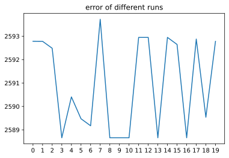
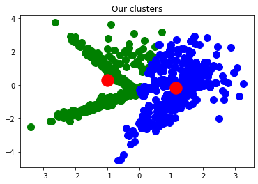
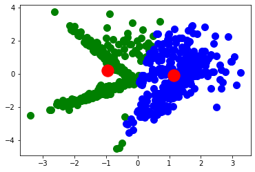
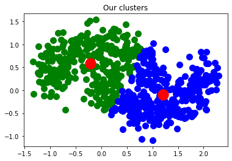
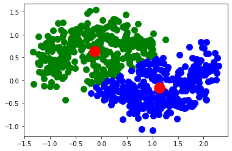
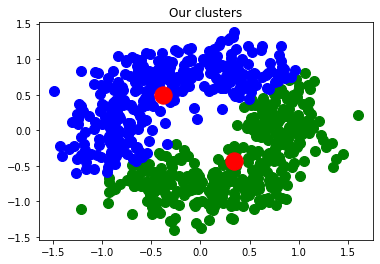
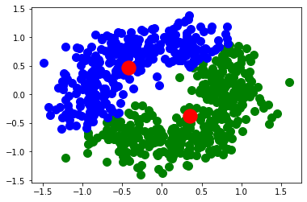

# CE-40717: Machine Learning

## HW8-Clustering & Reinforcement Learning

Amir Pourmand - 99210259

### Kmeans & GMM:

At this question, we tend to implement Kmeans & GMM algorithms. For this purpose, `DO NOT EMPLOY` ready-for-use python libraries. Use this implementation for solving the following questions. Kmeans should continue till centeroids won't change. Furthermore, GMM also should continue till the difference of two consecutive likelihood logarithm would be less than 0.1. Notice that after executing the Kmeans part, the primitive centroids of GMM should be identical with ultimate Kmeans centroids.


```python
from sklearn.datasets.samples_generator import make_classification, make_moons, make_circles
import numpy as np
import pandas as pd
import matplotlib.pyplot as plt
```

    /home/amir/anaconda3/lib/python3.8/site-packages/sklearn/utils/deprecation.py:143: FutureWarning: The sklearn.datasets.samples_generator module is  deprecated in version 0.22 and will be removed in version 0.24. The corresponding classes / functions should instead be imported from sklearn.datasets. Anything that cannot be imported from sklearn.datasets is now part of the private API.
      warnings.warn(message, FutureWarning)


#### Part 1:

Utilize the subsequent cell in order to create the Dataset. Afterwards, try to execute the algorithm with k=2 centroids. At Kmeans, it is recommended to execute the algorithm with several various starting states in order to eventually choose the best respective result.


```python
X,Y = make_classification(n_samples=700, n_features=10, n_informative=5,
                          n_redundant=0, n_clusters_per_class=2, n_classes=3)
```

## KMeans Implementation


```python
class KMeans:

    def __init__(self, n_clusters = 3, tolerance = 0.01, max_iter = 100, runs = 1):
        self.n_clusters = n_clusters
        self.tolerance = tolerance
        self.cluster_means = np.zeros(n_clusters)
        self.max_iter = max_iter
        self.runs = runs
        
    def fit(self, X,Y):
        row_count, col_count = X.shape
        
        X_values = self.__get_values(X)
        
        X_labels = np.zeros(row_count)
        
        costs = np.zeros(self.runs)
        all_clusterings = []

        for i in range(self.runs):
            cluster_means =  self.__initialize_means(X_values, row_count)

            for _ in range(self.max_iter):            
                previous_means = np.copy(cluster_means)
                
                distances = self.__compute_distances(X_values, cluster_means, row_count)
            
                X_labels = self.__label_examples(distances)
            
                cluster_means = self.__compute_means(X_values, X_labels, col_count)

                clusters_not_changed = np.abs(cluster_means - previous_means) < self.tolerance
                if np.all(clusters_not_changed) != False:
                    break
            
            X_values_with_labels = np.append(X_values, X_labels[:, np.newaxis], axis = 1)
            
            all_clusterings.append( (cluster_means, X_values_with_labels) )
            costs[i] = self.__compute_cost(X_values, X_labels, cluster_means)
        
        best_clustering_index = costs.argmin()
        
        self.costs = costs
        self.cost_ = costs[best_clustering_index]
        
        self.centroid,self.items = all_clusterings[best_clustering_index]
        self.y = Y
        return all_clusterings[best_clustering_index]
        
    def __initialize_means(self, X, row_count):
        return X [ np.random.choice(row_count, size=self.n_clusters, replace=False) ]
        
        
    def __compute_distances(self, X, cluster_means, row_count):
        distances = np.zeros((row_count, self.n_clusters))
        for cluster_mean_index, cluster_mean in enumerate(cluster_means):
            distances[:, cluster_mean_index] = np.linalg.norm(X - cluster_mean, axis = 1)
            
        return distances
    
    def __label_examples(self, distances):
        return distances.argmin(axis = 1)
    
    def __compute_means(self, X, labels, col_count):
        cluster_means = np.zeros((self.n_clusters, col_count))
        for cluster_mean_index, _ in enumerate(cluster_means):
            cluster_elements = X [ labels == cluster_mean_index ]
            if len(cluster_elements):
                cluster_means[cluster_mean_index, :] = cluster_elements.mean(axis = 0)
                
        return cluster_means
    
    def __compute_cost(self, X, labels, cluster_means):
        cost = 0
        for cluster_mean_index, cluster_mean in enumerate(cluster_means):
            cluster_elements = X [ labels == cluster_mean_index ]
            cost += np.linalg.norm(cluster_elements - cluster_mean, axis = 1).sum()
        
        return cost
            
    def __get_values(self, X):
        if isinstance(X, np.ndarray):
            return X
        return np.array(X)
    
    def predict(self):
        data=pd.DataFrame(self.items)
        added_column=list(data.columns)[-1]
        data['Label'] = self.y
        resultOfClustering=data.groupby([added_column])['Label'].agg(lambda x: x.value_counts().index[0])
        mapping = dict()
        for label in range(self.n_clusters):
            label_predicted = resultOfClustering[label]
            mapping[label] = label_predicted
        data['PredictedLabels']=data[added_column].map(mapping)
        return np.array(data['PredictedLabels'])
```


```python
kmeans=KMeans(2,max_iter=10000,runs=20)
centroids,kmeans_items=kmeans.fit(X,Y)
plt.plot(np.arange(len(kmeans.costs)),kmeans.costs)
plt.title('error of different runs')
plt.xticks(np.arange(len(kmeans.costs)))
plt.show();
```


    

    


```python

```

## Gaussian Mixture Model Implementation


```python
import numpy as np

import scipy.stats as sp
class GaussianMixModel():
    def __init__(self, X, k=2):
        X = np.asarray(X)
        self.m, self.n = X.shape
        self.data = X.copy()
        self.k = k
        
        self.sigma_arr = np.array([np.asmatrix(np.identity(self.n)) for i in range(self.k)])
        self.phi = np.ones(self.k)/self.k
        self.Z = np.asmatrix(np.empty((self.m, self.k), dtype=float))

     
    def initialize_means(self,means):
        self.mean_arr = means
    
    def fit(self, tol=0.1):

        num_iters = 0
        logl = 1
        previous_logl = 0
        while(logl-previous_logl > tol):
            previous_logl = self.loglikelihood()
            self.e_step()
            self.m_step()
            num_iters += 1
            logl = self.loglikelihood()
            print('Iteration %d: log-likelihood is %.6f'%(num_iters, logl))
        print('Terminate at %d-th iteration:log-likelihood is %.6f'%(num_iters, logl))

    def loglikelihood(self):
        logl = 0
        for i in range(self.m):
            tmp = 0
            for j in range(self.k):
                tmp += sp.multivariate_normal.pdf(self.data[i, :],self.mean_arr[j, :].A1,self.sigma_arr[j, :]) * self.phi[j]
            logl += np.log(tmp)
        return logl


    def e_step(self):
        for i in range(self.m):
            den = 0
            for j in range(self.k):
                num = sp.multivariate_normal.pdf(self.data[i, :],
                                                       self.mean_arr[j].A1,
                                                       self.sigma_arr[j]) *\
                      self.phi[j]
                den += num

                self.Z[i, j] = num
            self.Z[i, :] /= den
            assert self.Z[i, :].sum() - 1 < 1e-4  # Program stop if this condition is false

    def m_step(self):
         for j in range(self.k):
            const = self.Z[:, j].sum()
            self.phi[j] = 1/self.m * const
            _mu_j = np.zeros(self.n)
            _sigma_j = np.zeros((self.n, self.n))
            for i in range(self.m):
                _mu_j += (self.data[i, :] * self.Z[i, j])
                _sigma_j += self.Z[i, j] * ((self.data[i, :] - self.mean_arr[j, :]).T * (self.data[i, :] - self.mean_arr[j, :]))

            self.mean_arr[j] = _mu_j / const
            self.sigma_arr[j] = _sigma_j / const
    
    def predict(self):
        return np.array(np.argmax(gmm.Z,axis=1)).flatten()
```


```python
gmm=GaussianMixModel(X,k=2)
gmm.initialize_means(np.asmatrix(centroids))
gmm.fit()
```

    Iteration 1: log-likelihood is -11240.664685
    Iteration 2: log-likelihood is -11217.578370
    Iteration 3: log-likelihood is -11207.984489
    Iteration 4: log-likelihood is -11203.316664
    Iteration 5: log-likelihood is -11200.584656
    Iteration 6: log-likelihood is -11198.589541
    Iteration 7: log-likelihood is -11196.950208
    Iteration 8: log-likelihood is -11195.598834
    Iteration 9: log-likelihood is -11194.560923
    Iteration 10: log-likelihood is -11193.809382
    Iteration 11: log-likelihood is -11193.259931
    Iteration 12: log-likelihood is -11192.838590
    Iteration 13: log-likelihood is -11192.504004
    Iteration 14: log-likelihood is -11192.235454
    Iteration 15: log-likelihood is -11192.019740
    Iteration 16: log-likelihood is -11191.845614
    Iteration 17: log-likelihood is -11191.703256
    Iteration 18: log-likelihood is -11191.584824
    Iteration 19: log-likelihood is -11191.484495
    Iteration 20: log-likelihood is -11191.398087
    Terminate at 20-th iteration:log-likelihood is -11191.398087


#### Part 2:

In a separated cell, implement `Purity` and `Rand-Index` criteria in order to compare the performance of mentioned algorithms.

## KMeans 


```python
print('Purity Of kmeans: ',np.sum(kmeans.predict()==Y)/len(Y))
```


```python
from scipy.special import comb
def rand_index_score(clusters, classes):
    A = np.c_[(clusters, classes)]
    tp = sum(comb(np.bincount(A[A[:, 0] == i, 1]), 2).sum()
             for i in set(clusters))
    fp = comb(np.bincount(clusters), 2).sum() - tp
    fn = comb(np.bincount(classes), 2).sum() - tp
    tn = comb(len(A), 2) - tp - fp - fn
    return (tp + tn) / (tp + fp + fn + tn)
```


```python
print('rand index of kmeans', rand_index_score(kmeans.predict(),Y))
```

    rand index of kmeans 0.626176170038831


## Gaussian Mixture Model


```python
print('purity index: ', np.sum(gmm.predict() == Y)/len(Y))
```

    purity index:  0.3442857142857143


```python
print('rand index', rand_index_score(gmm.predict(),Y))
```

    rand index 0.6612957285918659


#### Part 3:

Use the following cell in order to create new Datasets. Afterwards, try to execute mentioned algorithms on new Dataset and eventually compare the recent results with the help of visualization(there is no problem for using relevant python libraries like `matplotlib`). Consider two clusters for this part.


```python
X, Y = make_classification(n_samples=700, n_features=2, n_informative=2, n_redundant=0, n_classes=2)
```


```python
k=2
kmeans=KMeans(k,max_iter=10000,runs=20)
centroids,kmeans_items=kmeans.fit(X,Y)

color_s =["green","blue","navy","maroon",'orange'] 
for i in range(k):
    plt.scatter(kmeans_items[kmeans_items[:,2]==i,0] , kmeans_items[kmeans_items[:,2]==i,1] 
                ,s=100, label = "cluster "+str(i), color =color_s[i])

plt.scatter(centroids[:,0] , centroids[:,1] , s = 300, color = 'red')
plt.title('Our clusters')
plt.show();
```


    

    


```python
gmm=GaussianMixModel(X,k)
gmm.initialize_means(np.asmatrix(centroids))
gmm.fit();
gmm_result = gmm.predict()
data=pd.DataFrame(X)
data['Predicted'] = gmm_result

for i in range(k):
    plt.scatter(data[data['Predicted']==i][0], data[data['Predicted']==i][1]
                ,s=100, label = "cluster "+str(i), color =color_s[i])

plt.scatter(np.array(gmm.mean_arr[:,0]).flatten() , np.array(gmm.mean_arr[:,1]).flatten() , s = 300, color = 'red')
plt.show();

```

    Iteration 1: log-likelihood is -2315.565750
    Iteration 2: log-likelihood is -2306.061991
    Iteration 3: log-likelihood is -2300.517351
    Iteration 4: log-likelihood is -2297.679316
    Iteration 5: log-likelihood is -2296.523375
    Iteration 6: log-likelihood is -2296.079572
    Iteration 7: log-likelihood is -2295.873169
    Iteration 8: log-likelihood is -2295.745392
    Iteration 9: log-likelihood is -2295.650630
    Terminate at 9-th iteration:log-likelihood is -2295.650630


    

    


```python
X, Y = make_moons(n_samples=700, noise=0.2)
```


```python
k=2
kmeans=KMeans(k,max_iter=10000,runs=20)
centroids,kmeans_items=kmeans.fit(X,Y)

color_s =["green","blue","navy","maroon",'orange'] 
for i in range(k):
    plt.scatter(kmeans_items[kmeans_items[:,2]==i,0] , kmeans_items[kmeans_items[:,2]==i,1] 
                ,s=100, label = "cluster "+str(i), color =color_s[i])

plt.scatter(centroids[:,0] , centroids[:,1] , s = 300, color = 'red')
plt.title('Our clusters')
plt.show();
```


    

    


```python
gmm=GaussianMixModel(X,k)
gmm.initialize_means(np.asmatrix(centroids))
gmm.fit();
gmm_result = gmm.predict()
data=pd.DataFrame(X)
data['Predicted'] = gmm_result

for i in range(k):
    plt.scatter(data[data['Predicted']==i][0], data[data['Predicted']==i][1]
                ,s=100, label = "cluster "+str(i), color =color_s[i])

plt.scatter(np.array(gmm.mean_arr[:,0]).flatten() , np.array(gmm.mean_arr[:,1]).flatten() , s = 300, color = 'red')
plt.show();

```

    Iteration 1: log-likelihood is -1398.603461
    Iteration 2: log-likelihood is -1393.737290
    Iteration 3: log-likelihood is -1388.745843
    Iteration 4: log-likelihood is -1380.915371
    Iteration 5: log-likelihood is -1369.135334
    Iteration 6: log-likelihood is -1353.728904
    Iteration 7: log-likelihood is -1338.594814
    Iteration 8: log-likelihood is -1328.926162
    Iteration 9: log-likelihood is -1325.052040
    Iteration 10: log-likelihood is -1323.946423
    Iteration 11: log-likelihood is -1323.666447
    Iteration 12: log-likelihood is -1323.588633
    Terminate at 12-th iteration:log-likelihood is -1323.588633


    

    


```python
X, Y = make_circles(n_samples=700, noise=0.2)
```


```python
k=2
kmeans=KMeans(k,max_iter=10000,runs=20)
centroids,kmeans_items=kmeans.fit(X,Y)

color_s =["green","blue","navy","maroon",'orange'] 
for i in range(k):
    plt.scatter(kmeans_items[kmeans_items[:,2]==i,0] , kmeans_items[kmeans_items[:,2]==i,1] 
                ,s=100, label = "cluster "+str(i), color =color_s[i])

plt.scatter(centroids[:,0] , centroids[:,1] , s = 300, color = 'red')
plt.title('Our clusters')
plt.show();
```


    

    


```python
gmm=GaussianMixModel(X,k)
gmm.initialize_means(np.asmatrix(centroids))
gmm.fit();
gmm_result = gmm.predict()
data=pd.DataFrame(X)
data['Predicted'] = gmm_result

for i in range(k):
    plt.scatter(data[data['Predicted']==i][0], data[data['Predicted']==i][1]
                ,s=100, label = "cluster "+str(i), color =color_s[i])

plt.scatter(np.array(gmm.mean_arr[:,0]).flatten() , np.array(gmm.mean_arr[:,1]).flatten() , s = 300, color = 'red')
plt.show();
```

    Iteration 1: log-likelihood is -1430.499494
    Iteration 2: log-likelihood is -1420.656967
    Iteration 3: log-likelihood is -1420.536376
    Iteration 4: log-likelihood is -1420.405494
    Iteration 5: log-likelihood is -1420.246694
    Iteration 6: log-likelihood is -1420.047562
    Iteration 7: log-likelihood is -1419.792324
    Iteration 8: log-likelihood is -1419.458444
    Iteration 9: log-likelihood is -1419.012108
    Iteration 10: log-likelihood is -1418.400887
    Iteration 11: log-likelihood is -1417.541077
    Iteration 12: log-likelihood is -1416.295229
    Iteration 13: log-likelihood is -1414.432159
    Iteration 14: log-likelihood is -1411.558106
    Iteration 15: log-likelihood is -1407.013733
    Iteration 16: log-likelihood is -1399.794125
    Iteration 17: log-likelihood is -1388.812963
    Iteration 18: log-likelihood is -1374.346416
    Iteration 19: log-likelihood is -1360.407653
    Iteration 20: log-likelihood is -1352.311886
    Iteration 21: log-likelihood is -1349.627012
    Iteration 22: log-likelihood is -1348.909115
    Iteration 23: log-likelihood is -1348.583644
    Iteration 24: log-likelihood is -1348.324640
    Iteration 25: log-likelihood is -1348.085898
    Iteration 26: log-likelihood is -1347.862059
    Iteration 27: log-likelihood is -1347.652813
    Iteration 28: log-likelihood is -1347.458349
    Iteration 29: log-likelihood is -1347.278751
    Iteration 30: log-likelihood is -1347.113916
    Iteration 31: log-likelihood is -1346.963547
    Iteration 32: log-likelihood is -1346.827163
    Iteration 33: log-likelihood is -1346.704131
    Iteration 34: log-likelihood is -1346.593698
    Iteration 35: log-likelihood is -1346.495023
    Terminate at 35-th iteration:log-likelihood is -1346.495023


    

    


### Reinforcement Learning:

At the bellow cell, besides the required libraries have been imported, feel free for changing the num_states variable with your desired number.


```python
import numpy as np
import random
import gym
```


```python
env = gym.make("MountainCar-v0")
num_actions = 3
num_states = 50

# first I should note that first one is position and second one is velocity! 
# so each state should be recognized using two discretized states
q_table = np.zeros(shape=(num_states,num_states, num_actions))

# You may change the inputs of any function as you desire.
SPACE_LOW = env.observation_space.low
SPACE_HIGH = env.observation_space.high
DISCOUNT_FACTOR = 0.95
EXPLORATION = 0.15

EPISODES = 100000
STEP_COUNT_MAX = 20000
DISPLAY=False
```

#### Part 1:

Next cell wants you supplement two functions. First for transforming the continuous space into discrete one (in order to make using q_table feasible), second for updating q_values based on the last action done by agent.


```python
def discretize_state():
    return np.abs(SPACE_HIGH-SPACE_LOW)/num_states

def env_state_to_Q_state(state):
    return np.round((state - SPACE_LOW)/discretize_state()).astype(int)

#p is position , v is velocity, p_ is position_new, v_ is velocity_new
def update_q(p, v, p_, v_, action, eta, reward):
    if np.random.uniform(0,1) < EXPLORATION:
        action_after = np.random.choice(env.action_space.n)
    else:
        action_after = np.argmax(q_table[p_][v_])
    q_table[p][v][action] = q_table[p][v][action] + eta * (reward + DISCOUNT_FACTOR *  q_table[p_][v_][action_after] - q_table[p][v][action])
```

#### Part 2:

At the following cell, the ends of two functions are getting current action based on the policy and defining the training process respectively.


```python
# You may change the inputs of any function as you desire.
def get_action():
    global EXPLORATION
    sum_reward_every_thousand = 0
    eta = 0.1
    for episode in range(EPISODES):
        state = env.reset()
        sum_reward = 0
        
        if episode < 30000:
            EXPLORATION = 0.15
            eta = 0.1
        else:
            EXPLORATION = (0.15)* (0.99)**((episode-30000)//100)
            eta = (0.1) * (0.99)**((episode-30000)//10000)


        for step in range(STEP_COUNT_MAX):

            if episode % 1000 == 1 and DISPLAY:
                env.render()

            p, v = env_state_to_Q_state(state)
            if np.random.uniform(0, 1) < EXPLORATION:
                action = np.random.choice(env.action_space.n) 
            else:
                action = np.argmax(q_table[p][v])
            state, reward, done, _ = env.step(action)
            sum_reward += reward

            p_, v_ = env_state_to_Q_state(state)
            update_q(p,v,p_, v_, action, eta, reward)

            if done:
                break
        
        sum_reward_every_thousand+= sum_reward

        if episode % 1000 == 1:
            print(f'Episode: {episode}, Total Reward: {sum_reward}, Mean Reward for previous thousand: {sum_reward_every_thousand/1000}')
            sum_reward_every_thousand=0
        
        

def q_learning():
    return np.argmax(q_table, axis=2) 


def save_policy():
    np.save('policy.npy', q_learning())
```


```python
get_action()
```

    Episode: 1, Total Reward: -179.0, Mean Reward for previous thousand: -0.301
    Episode: 1001, Total Reward: -193.0, Mean Reward for previous thousand: -157.109
    Episode: 2001, Total Reward: -115.0, Mean Reward for previous thousand: -152.583
    Episode: 3001, Total Reward: -117.0, Mean Reward for previous thousand: -143.079
    Episode: 4001, Total Reward: -149.0, Mean Reward for previous thousand: -166.126
    Episode: 5001, Total Reward: -115.0, Mean Reward for previous thousand: -160.521
    Episode: 6001, Total Reward: -159.0, Mean Reward for previous thousand: -146.022
    Episode: 7001, Total Reward: -150.0, Mean Reward for previous thousand: -145.918
    Episode: 8001, Total Reward: -126.0, Mean Reward for previous thousand: -146.489
    Episode: 9001, Total Reward: -146.0, Mean Reward for previous thousand: -144.533
    Episode: 10001, Total Reward: -158.0, Mean Reward for previous thousand: -149.24
    Episode: 11001, Total Reward: -147.0, Mean Reward for previous thousand: -145.605
    Episode: 12001, Total Reward: -144.0, Mean Reward for previous thousand: -151.54
    Episode: 13001, Total Reward: -150.0, Mean Reward for previous thousand: -143.567
    Episode: 14001, Total Reward: -113.0, Mean Reward for previous thousand: -147.717
    Episode: 15001, Total Reward: -145.0, Mean Reward for previous thousand: -144.082
    Episode: 16001, Total Reward: -164.0, Mean Reward for previous thousand: -149.133
    Episode: 17001, Total Reward: -140.0, Mean Reward for previous thousand: -141.656
    Episode: 18001, Total Reward: -141.0, Mean Reward for previous thousand: -144.041
    Episode: 19001, Total Reward: -145.0, Mean Reward for previous thousand: -143.146
    Episode: 20001, Total Reward: -143.0, Mean Reward for previous thousand: -144.561
    Episode: 21001, Total Reward: -146.0, Mean Reward for previous thousand: -154.918
    Episode: 22001, Total Reward: -118.0, Mean Reward for previous thousand: -146.952
    Episode: 23001, Total Reward: -164.0, Mean Reward for previous thousand: -143.887
    Episode: 24001, Total Reward: -167.0, Mean Reward for previous thousand: -144.984
    Episode: 25001, Total Reward: -191.0, Mean Reward for previous thousand: -139.732
    Episode: 26001, Total Reward: -200.0, Mean Reward for previous thousand: -150.19
    Episode: 27001, Total Reward: -135.0, Mean Reward for previous thousand: -148.45
    Episode: 28001, Total Reward: -133.0, Mean Reward for previous thousand: -147.619
    Episode: 29001, Total Reward: -118.0, Mean Reward for previous thousand: -145.583
    Episode: 30001, Total Reward: -156.0, Mean Reward for previous thousand: -144.799
    Episode: 31001, Total Reward: -122.0, Mean Reward for previous thousand: -156.688
    Episode: 32001, Total Reward: -92.0, Mean Reward for previous thousand: -141.966
    Episode: 33001, Total Reward: -115.0, Mean Reward for previous thousand: -138.183
    Episode: 34001, Total Reward: -143.0, Mean Reward for previous thousand: -136.637
    Episode: 35001, Total Reward: -155.0, Mean Reward for previous thousand: -134.013
    Episode: 36001, Total Reward: -150.0, Mean Reward for previous thousand: -135.702
    Episode: 37001, Total Reward: -155.0, Mean Reward for previous thousand: -136.64
    Episode: 38001, Total Reward: -110.0, Mean Reward for previous thousand: -134.927
    Episode: 39001, Total Reward: -170.0, Mean Reward for previous thousand: -124.576
    Episode: 40001, Total Reward: -94.0, Mean Reward for previous thousand: -123.188
    Episode: 41001, Total Reward: -151.0, Mean Reward for previous thousand: -127.61
    Episode: 42001, Total Reward: -157.0, Mean Reward for previous thousand: -129.317
    Episode: 43001, Total Reward: -166.0, Mean Reward for previous thousand: -129.223
    Episode: 44001, Total Reward: -150.0, Mean Reward for previous thousand: -130.183
    Episode: 45001, Total Reward: -157.0, Mean Reward for previous thousand: -128.477
    Episode: 46001, Total Reward: -169.0, Mean Reward for previous thousand: -130.575
    Episode: 47001, Total Reward: -141.0, Mean Reward for previous thousand: -136.959
    Episode: 48001, Total Reward: -110.0, Mean Reward for previous thousand: -133.705
    Episode: 49001, Total Reward: -111.0, Mean Reward for previous thousand: -132.777
    Episode: 50001, Total Reward: -115.0, Mean Reward for previous thousand: -126.226
    Episode: 51001, Total Reward: -108.0, Mean Reward for previous thousand: -126.466
    Episode: 52001, Total Reward: -105.0, Mean Reward for previous thousand: -122.987
    Episode: 53001, Total Reward: -143.0, Mean Reward for previous thousand: -125.58
    Episode: 54001, Total Reward: -92.0, Mean Reward for previous thousand: -121.866
    Episode: 55001, Total Reward: -114.0, Mean Reward for previous thousand: -120.685
    Episode: 56001, Total Reward: -161.0, Mean Reward for previous thousand: -122.66
    Episode: 57001, Total Reward: -113.0, Mean Reward for previous thousand: -120.863
    Episode: 58001, Total Reward: -106.0, Mean Reward for previous thousand: -121.389
    Episode: 59001, Total Reward: -155.0, Mean Reward for previous thousand: -120.685
    Episode: 60001, Total Reward: -111.0, Mean Reward for previous thousand: -125.054
    Episode: 61001, Total Reward: -91.0, Mean Reward for previous thousand: -123.145
    Episode: 62001, Total Reward: -89.0, Mean Reward for previous thousand: -123.642
    Episode: 63001, Total Reward: -109.0, Mean Reward for previous thousand: -121.458
    Episode: 64001, Total Reward: -149.0, Mean Reward for previous thousand: -121.11
    Episode: 65001, Total Reward: -109.0, Mean Reward for previous thousand: -118.842
    Episode: 66001, Total Reward: -105.0, Mean Reward for previous thousand: -117.851
    Episode: 67001, Total Reward: -93.0, Mean Reward for previous thousand: -118.363
    Episode: 68001, Total Reward: -108.0, Mean Reward for previous thousand: -118.588
    Episode: 69001, Total Reward: -155.0, Mean Reward for previous thousand: -117.849
    Episode: 70001, Total Reward: -103.0, Mean Reward for previous thousand: -117.886
    Episode: 71001, Total Reward: -154.0, Mean Reward for previous thousand: -119.152
    Episode: 72001, Total Reward: -88.0, Mean Reward for previous thousand: -119.221
    Episode: 73001, Total Reward: -105.0, Mean Reward for previous thousand: -118.423
    Episode: 74001, Total Reward: -141.0, Mean Reward for previous thousand: -118.104
    Episode: 75001, Total Reward: -84.0, Mean Reward for previous thousand: -116.182
    Episode: 76001, Total Reward: -86.0, Mean Reward for previous thousand: -114.815
    Episode: 77001, Total Reward: -171.0, Mean Reward for previous thousand: -116.111
    Episode: 78001, Total Reward: -154.0, Mean Reward for previous thousand: -116.999
    Episode: 79001, Total Reward: -89.0, Mean Reward for previous thousand: -115.477
    Episode: 80001, Total Reward: -104.0, Mean Reward for previous thousand: -116.467
    Episode: 81001, Total Reward: -109.0, Mean Reward for previous thousand: -115.918
    Episode: 82001, Total Reward: -90.0, Mean Reward for previous thousand: -115.687
    Episode: 83001, Total Reward: -106.0, Mean Reward for previous thousand: -116.255
    Episode: 84001, Total Reward: -89.0, Mean Reward for previous thousand: -116.218
    Episode: 85001, Total Reward: -90.0, Mean Reward for previous thousand: -115.675
    Episode: 86001, Total Reward: -159.0, Mean Reward for previous thousand: -114.176
    Episode: 87001, Total Reward: -105.0, Mean Reward for previous thousand: -115.347
    Episode: 88001, Total Reward: -84.0, Mean Reward for previous thousand: -115.736
    Episode: 89001, Total Reward: -145.0, Mean Reward for previous thousand: -114.92
    Episode: 90001, Total Reward: -108.0, Mean Reward for previous thousand: -114.142
    Episode: 91001, Total Reward: -108.0, Mean Reward for previous thousand: -115.576
    Episode: 92001, Total Reward: -105.0, Mean Reward for previous thousand: -115.641
    Episode: 93001, Total Reward: -108.0, Mean Reward for previous thousand: -115.379
    Episode: 94001, Total Reward: -105.0, Mean Reward for previous thousand: -115.35
    Episode: 95001, Total Reward: -153.0, Mean Reward for previous thousand: -114.946
    Episode: 96001, Total Reward: -106.0, Mean Reward for previous thousand: -114.093
    Episode: 97001, Total Reward: -106.0, Mean Reward for previous thousand: -114.282
    Episode: 98001, Total Reward: -89.0, Mean Reward for previous thousand: -114.929
    Episode: 99001, Total Reward: -104.0, Mean Reward for previous thousand: -115.684


```python
save_policy()
```

#### Part 3:

Ultimately, the score function examines the average performance of Agent (after nearly 1000 times) based on previous implementations.


```python
# Attention: don't change this function. we will use this to grade your policy which you will hand in with policy.npy
# btw you can use it to see how you are performing. Uncomment two lines which are commented to be able to see what is happening visually.
def score():
    policy, scores = np.load("policy.npy"), []
    for episode in range(1000):
        print(f"******Episode {episode}")
        state, score, done, step = env_state_to_Q_state(env.reset()), 0, False, 0
        while not done:
            # time.sleep(0.04)
            p,v = state
            action = policy[p,v]
            state, reward, done, _ = env.step(action)
            state = env_state_to_Q_state(state)
            step += 1
            score += int(reward)
            
        print(f"Score:{score}")
        scores.append(score)
    print(f"Average score over 1000 run : {np.array(scores).mean()}")

score()
```

    *****Episode 306
    Score:-150
    ******Episode 307
    Score:-156
    ******Episode 308
    Score:-111
    ******Episode 309
    Score:-91
    ******Episode 310
    Score:-84
    ******Episode 311
    Score:-109
    ******Episode 312
    Score:-158
    ******Episode 313
    Score:-104
    ******Episode 314
    Score:-85
    ******Episode 315
    Score:-108
    ******Episode 316
    Score:-147
    ******Episode 317
    Score:-104
    ******Episode 318
    Score:-105
    ******Episode 319
    Score:-90
    ******Episode 320
    Score:-104
    ******Episode 321
    Score:-106
    ******Episode 322
    Score:-147
    ******Episode 323
    Score:-104
    ******Episode 324
    Score:-85
    ******Episode 325
    Score:-104
    ******Episode 326
    Score:-149
    ******Episode 327
    Score:-90
    ******Episode 328
    Score:-109
    ******Episode 329
    Score:-85
    ******Episode 330
    Score:-90
    ******Episode 331
    Score:-93
    ******Episode 332
    Score:-106
    ******Episode 333
    Score:-156
    ******Episode 334
    Score:-88
    ******Episode 335
    Score:-84
    ******Episode 336
    Score:-106
    ******Episode 337
    Score:-95
    ******Episode 338
    Score:-85
    ******Episode 339
    Score:-125
    ******Episode 340
    Score:-106
    ******Episode 341
    Score:-154
    ******Episode 342
    Score:-104
    ******Episode 343
    Score:-106
    ******Episode 344
    Score:-150
    ******Episode 345
    Score:-89
    ******Episode 346
    Score:-110
    ******Episode 347
    Score:-109
    ******Episode 348
    Score:-88
    ******Episode 349
    Score:-157
    ******Episode 350
    Score:-105
    ******Episode 351
    Score:-110
    ******Episode 352
    Score:-109
    ******Episode 353
    Score:-108
    ******Episode 354
    Score:-173
    ******Episode 355
    Score:-174
    ******Episode 356
    Score:-150
    ******Episode 357
    Score:-96
    ******Episode 358
    Score:-84
    ******Episode 359
    Score:-157
    ******Episode 360
    Score:-89
    ******Episode 361
    Score:-147
    ******Episode 362
    Score:-106
    ******Episode 363
    Score:-105
    ******Episode 364
    Score:-110
    ******Episode 365
    Score:-105
    ******Episode 366
    Score:-105
    ******Episode 367
    Score:-104
    ******Episode 368
    Score:-105
    ******Episode 369
    Score:-106
    ******Episode 370
    Score:-105
    ******Episode 371
    Score:-160
    ******Episode 372
    Score:-106
    ******Episode 373
    Score:-105
    ******Episode 374
    Score:-106
    ******Episode 375
    Score:-106
    ******Episode 376
    Score:-104
    ******Episode 377
    Score:-107
    ******Episode 378
    Score:-106
    ******Episode 379
    Score:-86
    ******Episode 380
    Score:-157
    ******Episode 381
    Score:-110
    ******Episode 382
    Score:-86
    ******Episode 383
    Score:-104
    ******Episode 384
    Score:-101
    ******Episode 385
    Score:-106
    ******Episode 386
    Score:-158
    ******Episode 387
    Score:-101
    ******Episode 388
    Score:-84
    ******Episode 389
    Score:-109
    ******Episode 390
    Score:-111
    ******Episode 391
    Score:-104
    ******Episode 392
    Score:-88
    ******Episode 393
    Score:-105
    ******Episode 394
    Score:-106
    ******Episode 395
    Score:-107
    ******Episode 396
    Score:-157
    ******Episode 397
    Score:-165
    ******Episode 398
    Score:-84
    ******Episode 399
    Score:-106
    ******Episode 400
    Score:-110
    ******Episode 401
    Score:-105
    ******Episode 402
    Score:-156
    ******Episode 403
    Score:-98
    ******Episode 404
    Score:-85
    ******Episode 405
    Score:-150
    ******Episode 406
    Score:-106
    ******Episode 407
    Score:-105
    ******Episode 408
    Score:-109
    ******Episode 409
    Score:-104
    ******Episode 410
    Score:-95
    ******Episode 411
    Score:-103
    ******Episode 412
    Score:-102
    ******Episode 413
    Score:-110
    ******Episode 414
    Score:-106
    ******Episode 415
    Score:-106
    ******Episode 416
    Score:-109
    ******Episode 417
    Score:-150
    ******Episode 418
    Score:-106
    ******Episode 419
    Score:-109
    ******Episode 420
    Score:-150
    ******Episode 421
    Score:-161
    ******Episode 422
    Score:-106
    ******Episode 423
    Score:-106
    ******Episode 424
    Score:-156
    ******Episode 425
    Score:-106
    ******Episode 426
    Score:-150
    ******Episode 427
    Score:-150
    ******Episode 428
    Score:-159
    ******Episode 429
    Score:-109
    ******Episode 430
    Score:-84
    ******Episode 431
    Score:-90
    ******Episode 432
    Score:-159
    ******Episode 433
    Score:-105
    ******Episode 434
    Score:-150
    ******Episode 435
    Score:-86
    ******Episode 436
    Score:-151
    ******Episode 437
    Score:-154
    ******Episode 438
    Score:-105
    ******Episode 439
    Score:-106
    ******Episode 440
    Score:-108
    ******Episode 441
    Score:-147
    ******Episode 442
    Score:-106
    ******Episode 443
    Score:-154
    ******Episode 444
    Score:-105
    ******Episode 445
    Score:-105
    ******Episode 446
    Score:-154
    ******Episode 447
    Score:-96
    ******Episode 448
    Score:-147
    ******Episode 449
    Score:-150
    ******Episode 450
    Score:-144
    ******Episode 451
    Score:-99
    ******Episode 452
    Score:-159
    ******Episode 453
    Score:-106
    ******Episode 454
    Score:-175
    ******Episode 455
    Score:-109
    ******Episode 456
    Score:-90
    ******Episode 457
    Score:-86
    ******Episode 458
    Score:-110
    ******Episode 459
    Score:-98
    ******Episode 460
    Score:-150
    ******Episode 461
    Score:-110
    ******Episode 462
    Score:-131
    ******Episode 463
    Score:-105
    ******Episode 464
    Score:-151
    ******Episode 465
    Score:-159
    ******Episode 466
    Score:-99
    ******Episode 467
    Score:-105
    ******Episode 468
    Score:-150
    ******Episode 469
    Score:-158
    ******Episode 470
    Score:-104
    ******Episode 471
    Score:-113
    ******Episode 472
    Score:-93
    ******Episode 473
    Score:-90
    ******Episode 474
    Score:-104
    ******Episode 475
    Score:-109
    ******Episode 476
    Score:-84
    ******Episode 477
    Score:-147
    ******Episode 478
    Score:-89
    ******Episode 479
    Score:-154
    ******Episode 480
    Score:-104
    ******Episode 481
    Score:-103
    ******Episode 482
    Score:-158
    ******Episode 483
    Score:-156
    ******Episode 484
    Score:-104
    ******Episode 485
    Score:-154
    ******Episode 486
    Score:-110
    ******Episode 487
    Score:-105
    ******Episode 488
    Score:-106
    ******Episode 489
    Score:-106
    ******Episode 490
    Score:-151
    ******Episode 491
    Score:-145
    ******Episode 492
    Score:-90
    ******Episode 493
    Score:-84
    ******Episode 494
    Score:-91
    ******Episode 495
    Score:-156
    ******Episode 496
    Score:-109
    ******Episode 497
    Score:-109
    ******Episode 498
    Score:-89
    ******Episode 499
    Score:-165
    ******Episode 500
    Score:-109
    ******Episode 501
    Score:-109
    ******Episode 502
    Score:-104
    ******Episode 503
    Score:-150
    ******Episode 504
    Score:-106
    ******Episode 505
    Score:-110
    ******Episode 506
    Score:-106
    ******Episode 507
    Score:-107
    ******Episode 508
    Score:-106
    ******Episode 509
    Score:-159
    ******Episode 510
    Score:-152
    ******Episode 511
    Score:-178
    ******Episode 512
    Score:-89
    ******Episode 513
    Score:-105
    ******Episode 514
    Score:-110
    ******Episode 515
    Score:-161
    ******Episode 516
    Score:-106
    ******Episode 517
    Score:-161
    ******Episode 518
    Score:-109
    ******Episode 519
    Score:-159
    ******Episode 520
    Score:-105
    ******Episode 521
    Score:-90
    ******Episode 522
    Score:-90
    ******Episode 523
    Score:-84
    ******Episode 524
    Score:-147
    ******Episode 525
    Score:-172
    ******Episode 526
    Score:-93
    ******Episode 527
    Score:-158
    ******Episode 528
    Score:-106
    ******Episode 529
    Score:-106
    ******Episode 530
    Score:-105
    ******Episode 531
    Score:-86
    ******Episode 532
    Score:-88
    ******Episode 533
    Score:-158
    ******Episode 534
    Score:-149
    ******Episode 535
    Score:-106
    ******Episode 536
    Score:-89
    ******Episode 537
    Score:-109
    ******Episode 538
    Score:-105
    ******Episode 539
    Score:-104
    ******Episode 540
    Score:-105
    ******Episode 541
    Score:-86
    ******Episode 542
    Score:-105
    ******Episode 543
    Score:-151
    ******Episode 544
    Score:-88
    ******Episode 545
    Score:-118
    ******Episode 546
    Score:-106
    ******Episode 547
    Score:-106
    ******Episode 548
    Score:-156
    ******Episode 549
    Score:-151
    ******Episode 550
    Score:-107
    ******Episode 551
    Score:-160
    ******Episode 552
    Score:-106
    ******Episode 553
    Score:-105
    ******Episode 554
    Score:-150
    ******Episode 555
    Score:-89
    ******Episode 556
    Score:-105
    ******Episode 557
    Score:-106
    ******Episode 558
    Score:-86
    ******Episode 559
    Score:-110
    ******Episode 560
    Score:-101
    ******Episode 561
    Score:-109
    ******Episode 562
    Score:-108
    ******Episode 563
    Score:-109
    ******Episode 564
    Score:-106
    ******Episode 565
    Score:-154
    ******Episode 566
    Score:-88
    ******Episode 567
    Score:-110
    ******Episode 568
    Score:-106
    ******Episode 569
    Score:-151
    ******Episode 570
    Score:-155
    ******Episode 571
    Score:-165
    ******Episode 572
    Score:-150
    ******Episode 573
    Score:-115
    ******Episode 574
    Score:-102
    ******Episode 575
    Score:-104
    ******Episode 576
    Score:-104
    ******Episode 577
    Score:-105
    ******Episode 578
    Score:-150
    ******Episode 579
    Score:-109
    ******Episode 580
    Score:-86
    ******Episode 581
    Score:-104
    ******Episode 582
    Score:-107
    ******Episode 583
    Score:-150
    ******Episode 584
    Score:-156
    ******Episode 585
    Score:-110
    ******Episode 586
    Score:-158
    ******Episode 587
    Score:-108
    ******Episode 588
    Score:-109
    ******Episode 589
    Score:-127
    ******Episode 590
    Score:-109
    ******Episode 591
    Score:-108
    ******Episode 592
    Score:-110
    ******Episode 593
    Score:-104
    ******Episode 594
    Score:-104
    ******Episode 595
    Score:-102
    ******Episode 596
    Score:-106
    ******Episode 597
    Score:-147
    ******Episode 598
    Score:-90
    ******Episode 599
    Score:-106
    ******Episode 600
    Score:-95
    ******Episode 601
    Score:-107
    ******Episode 602
    Score:-150
    ******Episode 603
    Score:-175
    ******Episode 604
    Score:-152
    ******Episode 605
    Score:-88
    ******Episode 606
    Score:-159
    ******Episode 607
    Score:-151
    ******Episode 608
    Score:-107
    ******Episode 609
    Score:-96
    ******Episode 610
    Score:-89
    ******Episode 611
    Score:-110
    ******Episode 612
    Score:-178
    ******Episode 613
    Score:-86
    ******Episode 614
    Score:-106
    ******Episode 615
    Score:-105
    ******Episode 616
    Score:-91
    ******Episode 617
    Score:-150
    ******Episode 618
    Score:-160
    ******Episode 619
    Score:-107
    ******Episode 620
    Score:-149
    ******Episode 621
    Score:-174
    ******Episode 622
    Score:-105
    ******Episode 623
    Score:-109
    ******Episode 624
    Score:-109
    ******Episode 625
    Score:-106
    ******Episode 626
    Score:-106
    ******Episode 627
    Score:-108
    ******Episode 628
    Score:-111
    ******Episode 629
    Score:-144
    ******Episode 630
    Score:-109
    ******Episode 631
    Score:-90
    ******Episode 632
    Score:-109
    ******Episode 633
    Score:-110
    ******Episode 634
    Score:-88
    ******Episode 635
    Score:-113
    ******Episode 636
    Score:-91
    ******Episode 637
    Score:-174
    ******Episode 638
    Score:-150
    ******Episode 639
    Score:-150
    ******Episode 640
    Score:-109
    ******Episode 641
    Score:-106
    ******Episode 642
    Score:-88
    ******Episode 643
    Score:-150
    ******Episode 644
    Score:-109
    ******Episode 645
    Score:-109
    ******Episode 646
    Score:-104
    ******Episode 647
    Score:-104
    ******Episode 648
    Score:-95
    ******Episode 649
    Score:-102
    ******Episode 650
    Score:-106
    ******Episode 651
    Score:-89
    ******Episode 652
    Score:-104
    ******Episode 653
    Score:-158
    ******Episode 654
    Score:-145
    ******Episode 655
    Score:-106
    ******Episode 656
    Score:-88
    ******Episode 657
    Score:-106
    ******Episode 658
    Score:-86
    ******Episode 659
    Score:-109
    ******Episode 660
    Score:-150
    ******Episode 661
    Score:-113
    ******Episode 662
    Score:-105
    ******Episode 663
    Score:-104
    ******Episode 664
    Score:-109
    ******Episode 665
    Score:-84
    ******Episode 666
    Score:-106
    ******Episode 667
    Score:-105
    ******Episode 668
    Score:-90
    ******Episode 669
    Score:-112
    ******Episode 670
    Score:-109
    ******Episode 671
    Score:-158
    ******Episode 672
    Score:-158
    ******Episode 673
    Score:-90
    ******Episode 674
    Score:-106
    ******Episode 675
    Score:-104
    ******Episode 676
    Score:-106
    ******Episode 677
    Score:-104
    ******Episode 678
    Score:-125
    ******Episode 679
    Score:-108
    ******Episode 680
    Score:-103
    ******Episode 681
    Score:-147
    ******Episode 682
    Score:-93
    ******Episode 683
    Score:-108
    ******Episode 684
    Score:-105
    ******Episode 685
    Score:-106
    ******Episode 686
    Score:-106
    ******Episode 687
    Score:-106
    ******Episode 688
    Score:-91
    ******Episode 689
    Score:-108
    ******Episode 690
    Score:-173
    ******Episode 691
    Score:-86
    ******Episode 692
    Score:-159
    ******Episode 693
    Score:-158
    ******Episode 694
    Score:-106
    ******Episode 695
    Score:-106
    ******Episode 696
    Score:-110
    ******Episode 697
    Score:-106
    ******Episode 698
    Score:-109
    ******Episode 699
    Score:-105
    ******Episode 700
    Score:-106
    ******Episode 701
    Score:-158
    ******Episode 702
    Score:-106
    ******Episode 703
    Score:-109
    ******Episode 704
    Score:-90
    ******Episode 705
    Score:-109
    ******Episode 706
    Score:-106
    ******Episode 707
    Score:-148
    ******Episode 708
    Score:-104
    ******Episode 709
    Score:-173
    ******Episode 710
    Score:-150
    ******Episode 711
    Score:-84
    ******Episode 712
    Score:-115
    ******Episode 713
    Score:-150
    ******Episode 714
    Score:-166
    ******Episode 715
    Score:-106
    ******Episode 716
    Score:-109
    ******Episode 717
    Score:-106
    ******Episode 718
    Score:-147
    ******Episode 719
    Score:-93
    ******Episode 720
    Score:-160
    ******Episode 721
    Score:-109
    ******Episode 722
    Score:-110
    ******Episode 723
    Score:-105
    ******Episode 724
    Score:-90
    ******Episode 725
    Score:-84
    ******Episode 726
    Score:-106
    ******Episode 727
    Score:-107
    ******Episode 728
    Score:-160
    ******Episode 729
    Score:-109
    ******Episode 730
    Score:-109
    ******Episode 731
    Score:-147
    ******Episode 732
    Score:-159
    ******Episode 733
    Score:-106
    ******Episode 734
    Score:-158
    ******Episode 735
    Score:-102
    ******Episode 736
    Score:-106
    ******Episode 737
    Score:-98
    ******Episode 738
    Score:-109
    ******Episode 739
    Score:-85
    ******Episode 740
    Score:-105
    ******Episode 741
    Score:-86
    ******Episode 742
    Score:-86
    ******Episode 743
    Score:-107
    ******Episode 744
    Score:-109
    ******Episode 745
    Score:-93
    ******Episode 746
    Score:-153
    ******Episode 747
    Score:-174
    ******Episode 748
    Score:-89
    ******Episode 749
    Score:-109
    ******Episode 750
    Score:-90
    ******Episode 751
    Score:-88
    ******Episode 752
    Score:-113
    ******Episode 753
    Score:-98
    ******Episode 754
    Score:-105
    ******Episode 755
    Score:-86
    ******Episode 756
    Score:-108
    ******Episode 757
    Score:-160
    ******Episode 758
    Score:-108
    ******Episode 759
    Score:-150
    ******Episode 760
    Score:-105
    ******Episode 761
    Score:-155
    ******Episode 762
    Score:-104
    ******Episode 763
    Score:-104
    ******Episode 764
    Score:-105
    ******Episode 765
    Score:-109
    ******Episode 766
    Score:-106
    ******Episode 767
    Score:-108
    ******Episode 768
    Score:-106
    ******Episode 769
    Score:-104
    ******Episode 770
    Score:-109
    ******Episode 771
    Score:-90
    ******Episode 772
    Score:-147
    ******Episode 773
    Score:-89
    ******Episode 774
    Score:-150
    ******Episode 775
    Score:-89
    ******Episode 776
    Score:-123
    ******Episode 777
    Score:-84
    ******Episode 778
    Score:-104
    ******Episode 779
    Score:-84
    ******Episode 780
    Score:-91
    ******Episode 781
    Score:-89
    ******Episode 782
    Score:-106
    ******Episode 783
    Score:-118
    ******Episode 784
    Score:-109
    ******Episode 785
    Score:-149
    ******Episode 786
    Score:-90
    ******Episode 787
    Score:-108
    ******Episode 788
    Score:-109
    ******Episode 789
    Score:-105
    ******Episode 790
    Score:-156
    ******Episode 791
    Score:-150
    ******Episode 792
    Score:-109
    ******Episode 793
    Score:-116
    ******Episode 794
    Score:-102
    ******Episode 795
    Score:-158
    ******Episode 796
    Score:-91
    ******Episode 797
    Score:-105
    ******Episode 798
    Score:-85
    ******Episode 799
    Score:-109
    ******Episode 800
    Score:-106
    ******Episode 801
    Score:-160
    ******Episode 802
    Score:-110
    ******Episode 803
    Score:-104
    ******Episode 804
    Score:-106
    ******Episode 805
    Score:-89
    ******Episode 806
    Score:-159
    ******Episode 807
    Score:-84
    ******Episode 808
    Score:-85
    ******Episode 809
    Score:-150
    ******Episode 810
    Score:-109
    ******Episode 811
    Score:-104
    ******Episode 812
    Score:-103
    ******Episode 813
    Score:-150
    ******Episode 814
    Score:-86
    ******Episode 815
    Score:-156
    ******Episode 816
    Score:-156
    ******Episode 817
    Score:-104
    ******Episode 818
    Score:-109
    ******Episode 819
    Score:-106
    ******Episode 820
    Score:-110
    ******Episode 821
    Score:-105
    ******Episode 822
    Score:-109
    ******Episode 823
    Score:-104
    ******Episode 824
    Score:-86
    ******Episode 825
    Score:-84
    ******Episode 826
    Score:-159
    ******Episode 827
    Score:-110
    ******Episode 828
    Score:-104
    ******Episode 829
    Score:-110
    ******Episode 830
    Score:-89
    ******Episode 831
    Score:-109
    ******Episode 832
    Score:-86
    ******Episode 833
    Score:-110
    ******Episode 834
    Score:-91
    ******Episode 835
    Score:-104
    ******Episode 836
    Score:-105
    ******Episode 837
    Score:-104
    ******Episode 838
    Score:-104
    ******Episode 839
    Score:-98
    ******Episode 840
    Score:-107
    ******Episode 841
    Score:-88
    ******Episode 842
    Score:-107
    ******Episode 843
    Score:-96
    ******Episode 844
    Score:-96
    ******Episode 845
    Score:-147
    ******Episode 846
    Score:-158
    ******Episode 847
    Score:-89
    ******Episode 848
    Score:-90
    ******Episode 849
    Score:-160
    ******Episode 850
    Score:-89
    ******Episode 851
    Score:-158
    ******Episode 852
    Score:-106
    ******Episode 853
    Score:-105
    ******Episode 854
    Score:-85
    ******Episode 855
    Score:-104
    ******Episode 856
    Score:-105
    ******Episode 857
    Score:-88
    ******Episode 858
    Score:-107
    ******Episode 859
    Score:-149
    ******Episode 860
    Score:-158
    ******Episode 861
    Score:-90
    ******Episode 862
    Score:-152
    ******Episode 863
    Score:-86
    ******Episode 864
    Score:-150
    ******Episode 865
    Score:-105
    ******Episode 866
    Score:-109
    ******Episode 867
    Score:-84
    ******Episode 868
    Score:-106
    ******Episode 869
    Score:-84
    ******Episode 870
    Score:-106
    ******Episode 871
    Score:-156
    ******Episode 872
    Score:-129
    ******Episode 873
    Score:-90
    ******Episode 874
    Score:-109
    ******Episode 875
    Score:-109
    ******Episode 876
    Score:-109
    ******Episode 877
    Score:-109
    ******Episode 878
    Score:-108
    ******Episode 879
    Score:-90
    ******Episode 880
    Score:-89
    ******Episode 881
    Score:-88
    ******Episode 882
    Score:-84
    ******Episode 883
    Score:-90
    ******Episode 884
    Score:-152
    ******Episode 885
    Score:-104
    ******Episode 886
    Score:-95
    ******Episode 887
    Score:-110
    ******Episode 888
    Score:-159
    ******Episode 889
    Score:-159
    ******Episode 890
    Score:-105
    ******Episode 891
    Score:-84
    ******Episode 892
    Score:-109
    ******Episode 893
    Score:-106
    ******Episode 894
    Score:-106
    ******Episode 895
    Score:-84
    ******Episode 896
    Score:-105
    ******Episode 897
    Score:-110
    ******Episode 898
    Score:-110
    ******Episode 899
    Score:-157
    ******Episode 900
    Score:-149
    ******Episode 901
    Score:-106
    ******Episode 902
    Score:-90
    ******Episode 903
    Score:-89
    ******Episode 904
    Score:-158
    ******Episode 905
    Score:-86
    ******Episode 906
    Score:-105
    ******Episode 907
    Score:-104
    ******Episode 908
    Score:-104
    ******Episode 909
    Score:-109
    ******Episode 910
    Score:-88
    ******Episode 911
    Score:-106
    ******Episode 912
    Score:-109
    ******Episode 913
    Score:-106
    ******Episode 914
    Score:-85
    ******Episode 915
    Score:-110
    ******Episode 916
    Score:-104
    ******Episode 917
    Score:-104
    ******Episode 918
    Score:-108
    ******Episode 919
    Score:-105
    ******Episode 920
    Score:-104
    ******Episode 921
    Score:-150
    ******Episode 922
    Score:-111
    ******Episode 923
    Score:-108
    ******Episode 924
    Score:-158
    ******Episode 925
    Score:-109
    ******Episode 926
    Score:-89
    ******Episode 927
    Score:-89
    ******Episode 928
    Score:-84
    ******Episode 929
    Score:-86
    ******Episode 930
    Score:-152
    ******Episode 931
    Score:-104
    ******Episode 932
    Score:-85
    ******Episode 933
    Score:-109
    ******Episode 934
    Score:-109
    ******Episode 935
    Score:-159
    ******Episode 936
    Score:-111
    ******Episode 937
    Score:-109
    ******Episode 938
    Score:-158
    ******Episode 939
    Score:-106
    ******Episode 940
    Score:-90
    ******Episode 941
    Score:-105
    ******Episode 942
    Score:-84
    ******Episode 943
    Score:-86
    ******Episode 944
    Score:-104
    ******Episode 945
    Score:-155
    ******Episode 946
    Score:-159
    ******Episode 947
    Score:-108
    ******Episode 948
    Score:-85
    ******Episode 949
    Score:-88
    ******Episode 950
    Score:-88
    ******Episode 951
    Score:-106
    ******Episode 952
    Score:-84
    ******Episode 953
    Score:-109
    ******Episode 954
    Score:-107
    ******Episode 955
    Score:-106
    ******Episode 956
    Score:-109
    ******Episode 957
    Score:-152
    ******Episode 958
    Score:-147
    ******Episode 959
    Score:-105
    ******Episode 960
    Score:-105
    ******Episode 961
    Score:-108
    ******Episode 962
    Score:-101
    ******Episode 963
    Score:-89
    ******Episode 964
    Score:-107
    ******Episode 965
    Score:-150
    ******Episode 966
    Score:-93
    ******Episode 967
    Score:-96
    ******Episode 968
    Score:-89
    ******Episode 969
    Score:-110
    ******Episode 970
    Score:-104
    ******Episode 971
    Score:-86
    ******Episode 972
    Score:-104
    ******Episode 973
    Score:-105
    ******Episode 974
    Score:-159
    ******Episode 975
    Score:-158
    ******Episode 976
    Score:-104
    ******Episode 977
    Score:-159
    ******Episode 978
    Score:-84
    ******Episode 979
    Score:-150
    ******Episode 980
    Score:-105
    ******Episode 981
    Score:-109
    ******Episode 982
    Score:-109
    ******Episode 983
    Score:-96
    ******Episode 984
    Score:-144
    ******Episode 985
    Score:-86
    ******Episode 986
    Score:-159
    ******Episode 987
    Score:-106
    ******Episode 988
    Score:-88
    ******Episode 989
    Score:-158
    ******Episode 990
    Score:-106
    ******Episode 991
    Score:-104
    ******Episode 992
    Score:-159
    ******Episode 993
    Score:-85
    ******Episode 994
    Score:-104
    ******Episode 995
    Score:-110
    ******Episode 996
    Score:-90
    ******Episode 997
    Score:-106
    ******Episode 998
    Score:-85
    ******Episode 999
    Score:-105
    Average score over 1000 run : -114.59


```python

```
